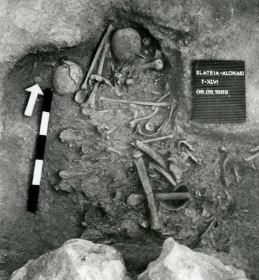
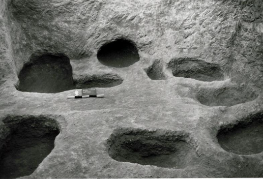
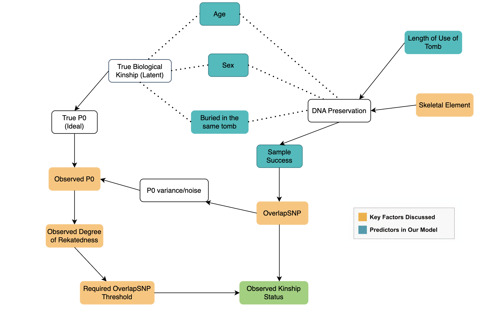
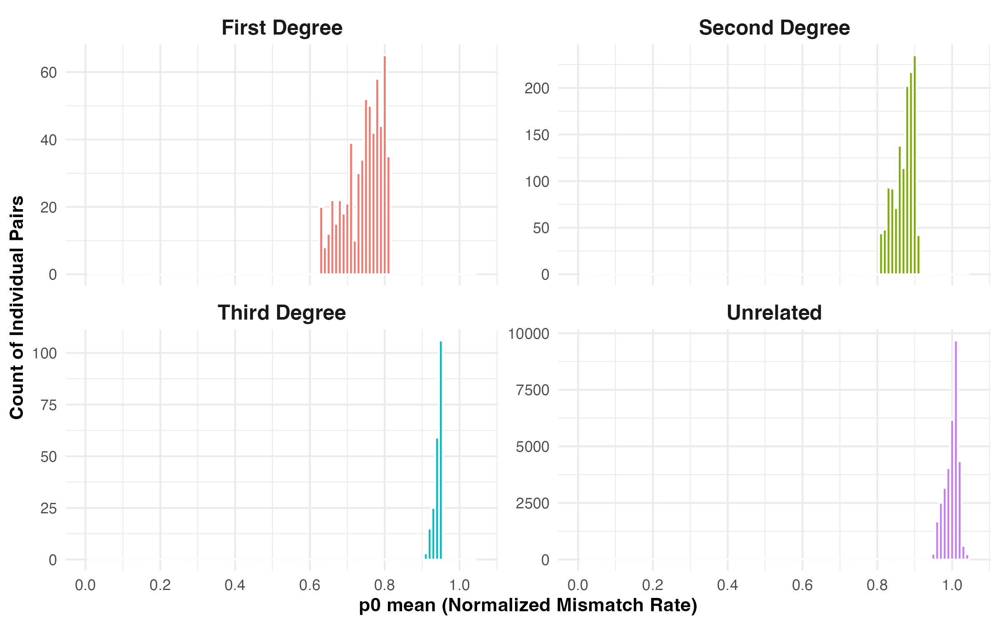
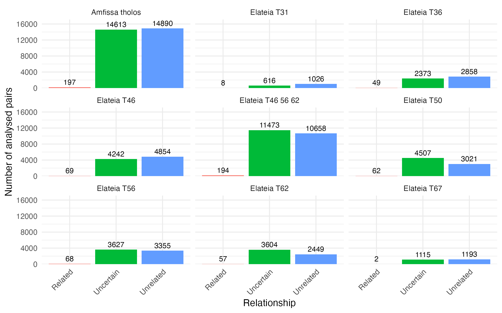
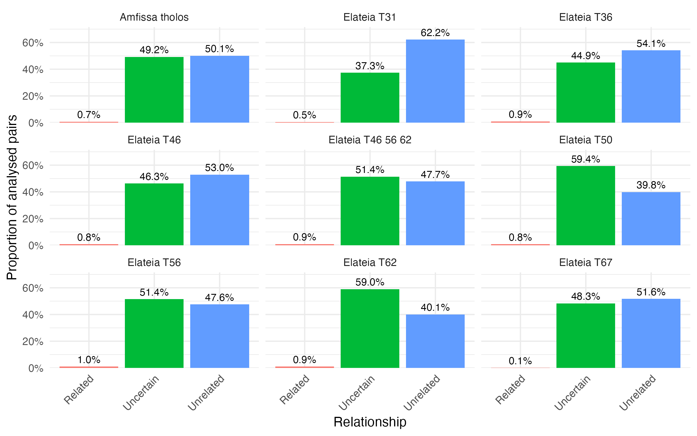
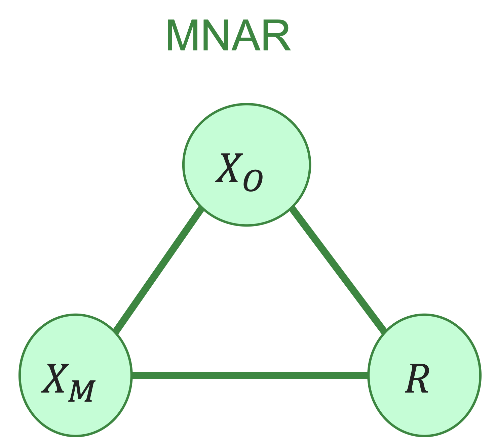
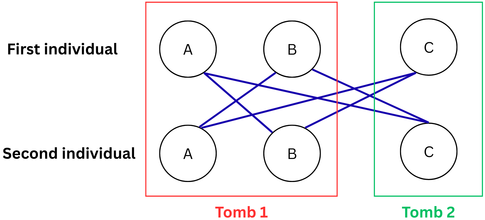

```{r setup, include=FALSE}
source("environmentSetUp.R")
source("Analysis/pairsdata.R")
source("Analysis/model_assumption.R")
source("Models/models_comparison.R")
```

## Outline

::::: columns
::: column
**1. Project Overview**

-   Overview

**2. Data Description**

-   Data Sets
-   Research Questions
-   Process

**3. Data Visualization**

-   Descriptive Plots
:::

::: column
**4. Model Fitting**

-   Limitation
-   Model Definition & Assumption
-   Model Output & Interpretation

**5. Discussion**
:::
:::::

## Outline

**1. Project Overview**

-   Overview

[**2. Data Description**]{style="color:lightgray;"}\

[**3. Data Visualization**]{style="color:lightgray;"}\

[**4. Model Fitting**]{style="color:lightgray;"}\

[**5. Discussion**]{style="color:lightgray;"}\

## Project Overview

**Grave Analysis**: How do different factors influence the ratio of relatedness and unrelatedness in a collective tomb from Mycenaean times?

::: {style="text-align: center;"}

:::

## Project Overview

-   **Two burial sites**
    -   Amfissa (tholos)
    -   Elateia (chamber tombs): T31, T36, T46, T50, T56, T62, T67\
        **Note:** Analyze T46, T56, and T62 both as a group and as individual tombs

::::: columns
::: column
{width="70%"}
:::

::: column
{width="70%"}
:::
:::::

## Outline

[**1. Project Overview**]{style="color:lightgray;"}\

**2. Data Description**

-   Data Sets
-   Research Questions
-   Process

[**3. Data Visualization**]{style="color:lightgray;"}\

[**4. Model Fitting**]{style="color:lightgray;"}\

[**5. Discussion**]{style="color:lightgray;"}\

## Data Description

**1. Tomb parameters** - Summary information for each tomb:

-   **Minimum number of individuals (MNI)**\

-   **Number of analysed individuals**\

-   **Length of tomb use (years)**\

-   **Sample success rate (%)**

## Data Description

**2. Individual metadata** - Information of each sampled individual:

-   **Sex**

-   **Age estimation**

-   **Skeletal element sampled**

-   **Tomb and site**

## Data Description

**3. Kinship results -** Pairwise relatedness results between individuals:

-   **Relationship category**: 1st / 2nd / 3rd degree

-   **Overlapping SNPs**: The total amount of shared genetic data available to compare two individuals

-   **P0 (Pairwise Mismatch Rate)**: proportion of SNPs that do **not** match between two individuals

## Research Questions

1.  [Develop and validate statistical models to predict the **difference between observed and potential relatedness**, using **tomb parameters** (length of use, estimated number of burials, sample success rate) as predictor variables, while accounting for potential confounding factors]{style="font-size:1.1em;"}

2.  [Build predictive models to estimate **relatedness** patterns using **individual-level covariates** (sex, age and skeletal element of sample), considering that some of these factors may be confounded with DNA preservation quality and sampling success]{style="font-size:1.1em;"}

## Kinship Estimation Framework (DAG)



## The READv2 Classification Process

READv2 (Relationship Estimation from Ancient DNA)

{fig-align="center"}

## Confirming Group Assignments

### P0 Distribution by Relationship Degree

{fig-align="center"}

::: {style="font-size: 0.75em; line-height: 1.2;"}
Faceted with free y-axes to visualise distribution despite sample imbalance
:::

## READv2 Performance & Statistical Validation

### False Positive Rates and Classification Power


::: {style="font-size: 0.75em; line-height: 1.2;"}
**Coverage**: How much of the genome we actually managed to recover from the ancient sample\
**Dashed Lines**: Specific data quality thresholds (500, 2,000, and 15,000 SNPs)
:::

## Empirical Precision of P0 vs. SNP Overlap

{fig-align="center"}

::: {style="font-size: 0.75em; line-height: 1.2;"}
$$CV_{\hat{P_0}} = \frac{\text{nonnormalised p0 serr}}{\text{nonnormalised p0}}$$

**Coefficient of Variation**: the relative precision of our kinship estimate
:::

## Outline

[**1. Project Overview**]{style="color:lightgray;"}\

[**2. Data Description**]{style="color:lightgray;"}\

**3. Data Visualization**

-   Descriptive Plots

[**4. Model Fitting**]{style="color:lightgray;"}\

[**5. Discussion**]{style="color:lightgray;"}\

## Data Visualization

### [Absolute number of analysed pairs per tomb]{style="font-size:26px;"}

{fig-align="center" width="70%"}

## Data Visualization

### [Relative number of analysed pairs per tomb]{style="font-size:26px;"}

{fig-align="center" width="70%"}

## Data Visualization

### [Kinship Networks]{style="font-size:26px;"}

::: {style="display:flex; gap:20px;"}
 
:::

## Data Visualization

### [Kinship Networks]{style="font-size:26px;"}

::: {style="display:flex; gap:20px;"}
 
:::

## Data Visualization

### [Kinship Networks]{style="font-size:26px;"}

::: {style="display:flex; gap:20px;"}
 
:::

## Data Visualization

### [Kinship Networks]{style="font-size:26px;"}

::: {style="display:flex; gap:20px;"}
 
:::

## Data Visualization

### [Kinship Networks]{style="font-size:26px;"}

::: {style="display:flex; gap:20px;"}
 
:::

## Outline

[**1. Project Overview**]{style="color:lightgray;"}\

[**2. Data Description**]{style="color:lightgray;"}\

[**3. Data Visualization**]{style="color:lightgray;"}\

**4. Model Fitting**

-   Limitation
-   Model Definition & Assumption
-   Model Output & Interpretation

[**5. Discussion**]{style="color:lightgray;"}\

## Model Fitting

### Limitation

#### 1. Tomb-level model not possible

-   **Small number of tombs**: Amfissa and 7 tombs from Elateia
-   For too many parameters: length of use, analysed individuals, effect of 4 types of skeletal elements

$\Rightarrow$ **With the available data, a meaningful tomb-level model is not possible**

## Model Fitting

### Limitation

#### 2. MNAR

{fig-align="center"}

## Model Fitting

### Limitation

#### 2. MNAR

{fig-align="center"}

$X_O$ : Observed variables $\rightarrow$ Tomb, Age, Sex, Overlapping SNPs,...

$X_M$ : Variables that are missing for some observations $\rightarrow$ Kinship status

$R$ : Missingness indicator

## Model Fitting

### Limitation - MNAR

$$
R =
\begin{cases}
1, & \text{if kinship is classified (1st/2nd/3rd)}, \\
0, & \text{if kinship status is classified as "Uncertain".}
\end{cases}
$$

Threshold:

-   1st degree $\rightarrow$ needs $\ge 500 \text{ SNPs}$
-   2nd degree $\rightarrow$ needs $\ge 2000 \text{ SNPs}$
-   3rd degree $\rightarrow$ needs $\ge 15000 \text{ SNPs}$

$$
\Rightarrow R = \mathbb{I}\!\left( \mathrm{OSNP} \ge \text{threshold depending on Kinship status} \right)
$$

$$\Rightarrow P(R | X_O, X_M) \text{ depends on } X_M = \text{Kinship status}$$ $\Rightarrow$ **MNAR**

## Model Fitting

### Limitation - MNAR

**Solution:** Apply only one threshold 15000 for all degrees of kinship

$$
R =
\begin{cases}
1, & \mathrm{OSNP} \ge 15000, \\
0, & \text{otherwise}
\end{cases}
$$

$$
R = \mathbb{I}\!\left( \mathrm{OSNP} \ge 15000 \right),
$$

$$\Rightarrow P(R | X_O, X_M) \text{ depends on } X_O = \text{Overlapping SNPs}$$

$\Rightarrow$ **MAR**

## Model Fitting

### Model Definition

{fig-align="center" width="90%"}

-   Observation: 1 pair (belongs to 2 tombs + 2 individuals)
-   Each individual appears in many pairs
-   Both within- and across-tomb pairs are observed

$\Rightarrow$ **Multi-Membership Generalized Linear Mixed Model (MM-GLMM)**

## Model Fitting

### Model Definition

Let $Y_{ij} = 1$ if individuals $i$ and $j$ are related, and $Y_{t,ij} = 0$ otherwise.

We assume:

$$
Y_{t,ij} \sim \text{Bernoulli}(\pi_{ij})
$$

where $\pi_{ij} = P(\text{related}_{ij} = 1)$.

**Multi-Membership Generalized Linear Mixed Model (MM-GLMM)**

$$
\text{logit}(\pi_{ij}) = \alpha + \mathbf{X}_{ij}^{\top}\boldsymbol{\beta} 
    + \underbrace{(w_i u_i + w_j u_j)}_{\text{Individual RE}} 
    + \underbrace{(w_{T(i)} v_{T(i)} + w_{T(j)} v_{T(j)})}_{\text{Tomb MM}}
$$

## Model Fitting

### Model Definition

$$
\text{logit}(\pi_{ij}) = \alpha + \mathbf{X}_{ij}^{\top}\boldsymbol{\beta} 
    + \underbrace{(w_i u_i + w_j u_j)}_{\text{Individual RE}} 
    + \underbrace{(w_{T(i)} v_{T(i)} + w_{T(j)} v_{T(j)})}_{\text{Tomb RE}}
$$

Where:

-   $\alpha$: Global intercept
-   $\mathbf{X}_{ij}$: Covariate vector
-   $u_i$: RE for Individual with $u \sim \mathcal{N}(0, \sigma^2_{\text{ind}})$
-   $v_t$: RE for Tomb with $v \sim \mathcal{N}(0, \sigma^2_{\text{tomb}})$
-   $w$: Weight $w_i$ = $w_j$ = $w_{T(i)}$ = $w_{T(j)}$ = 0.5

## Model Fitting


## Model Fitting

### Variables

```{r variables, echo=FALSE}
pairs_ind_show <- pairs_ind |>
  select(related_binary, sex_pair, age_pair, same_tomb, individual1_id, individual2_id, tomb1, tomb2)

set.seed(987)
pairs_ind_show |>
  slice_sample(n = 20) |>
  slice(11:20) |>
  gt() |>
  tab_header(
    title = "Variables in the model"
  )
```

-   Use r library "brms" (Bayesian Regression Models using 'Stan')
-   One version for all separated tombs
-   One version with Tomb 46, 56, 62 grouped as 1 tomb

## Model Fitting

### Model Output

```{r mod sep, echo=FALSE, out.height="500px"}
imp_binary_separate_nobone <- readRDS("unofficial work/models save/imp_binary_separate_nobone.rds")
imp_binary_separate_cat
```

## Model Fitting

### Model Output

```{r mod group, echo=FALSE, out.height="500px"}
imp_binary_group_nobone <- readRDS("unofficial work/models save/imp_binary_group_nobone.rds")
imp_binary_group_nobone
```

## Model Fitting

### Sampling health (Diagnostic)

1.  R-hat = 1.00: Excellent, all chains have converged to the same distribution.
2.  Effective Sample Size: Pretty large number of independent samples.

## Model Fitting

### Marginal effect

-   Model coefficients are on the log-odds scale
-   Marginal effects translate results to **predicted probabilities**
-   Results shown are **population-level averages**

```{r, echo=FALSE}
me_combined <- readRDS("unofficial work/me_tables/me_combined.rds")
me_combined
```

## Model Fitting

### Model Interpretation

#### Sex Pair

::: {style="display:flex; gap:20px;"}
 
:::

## Model Fitting

### Model Interpretation

#### Age Pair

::: {style="display:flex; gap:20px;"}
 
:::

## Model Fitting

### Model Interpretation

#### Tomb

::: {style="display:flex; gap:20px;"}
 
:::


## Model Fitting

### Model Interpretation

{fig-align="center" width="90%"}


## Discussion

### Model Assumption

1.  Equal RE weight assumption ($w = 0.5$)

-   Theoretically plausible (individual level)
-   MM models robust to weight misspecification (Wolff Smith & Beretvas (2014))

## Discussion

### Model Assumption

2.  Assumption of RE normality $u, v \sim \mathcal{N}(0, \sigma^2)$

```{r assumption sep}
plot_qq_both_effects(imp_binary_separate_nobone, "Separated tombs")
```

## Discussion

### Model Assumption

2.  Assumption of RE normality $u, v \sim \mathcal{N}(0, \sigma^2)$

```{r assumption group}
plot_qq_both_effects(imp_binary_group_nobone, "Grouped tombs")
```

## Discussion

### Model Assumption

2.  Assumption of RE normality $u, v \sim \mathcal{N}(0, \sigma^2)$

::::: columns
::: {.column width="50%"}
**Individual RE:**

-   Right skewed
-   **Risk:** Biased intercept and incorrect shape of the estimated RE distribution
-   **Mitigation:** Stable fixed effects and variance (McCulloch & Neuhaus (2011))
:::

::: {.column width="50%"}
**Tomb RE:**

-   Too few tombs
-   **Risk:** Biased RE variance
-   **Mitigation:** Unbiased fixed effects (Maas & Hox (2005))
:::
:::::

## Discussion

### Model Robust Check

```{r robust sep}
compare_model(robustcheck_models_separate, title = "Model Robust Check (Separated)")
```

## Discussion

### Model Robust Check

```{r robust group}
compare_model(robustcheck_models_group, title = "Model Robust Check (Grouped)")
```

## Bibliography

-   Charles E. McCulloch. John M. Neuhaus. "Misspecifying the Shape of a Random Effects Distribution: Why Getting It Wrong May Not Matter." Statist. Sci. 26 (3) 388 - 402, August 2011
-   Maas, C. J. M., & Hox, J. J. (2005). Sufficient Sample Sizes for Multilevel Modeling. Methodology: European Journal of Research Methods for the Behavioral and Social Sciences, 1(3), 86–92

## Appendix

### [Absolute relation of MNI and analysed individuals]{style="font-size:26px;"}

{width="70%"}
