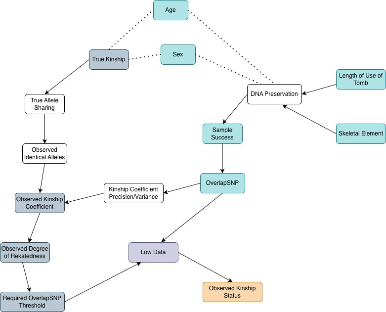
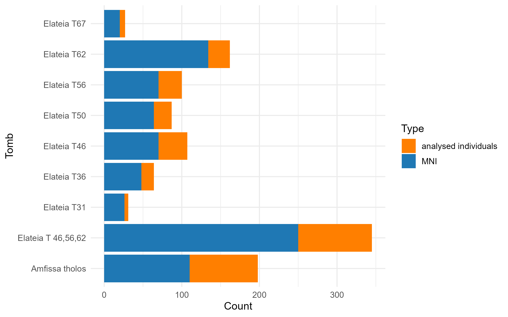
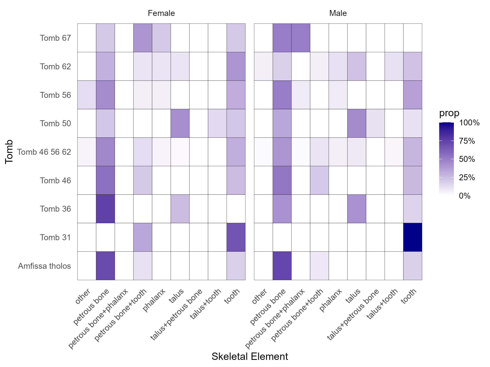
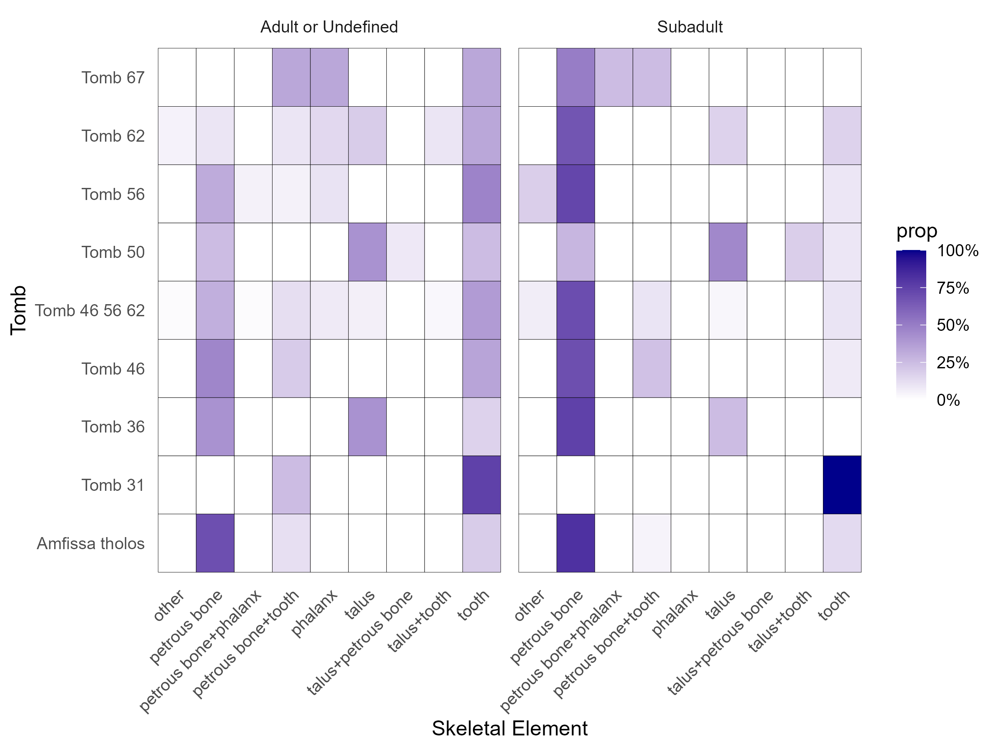
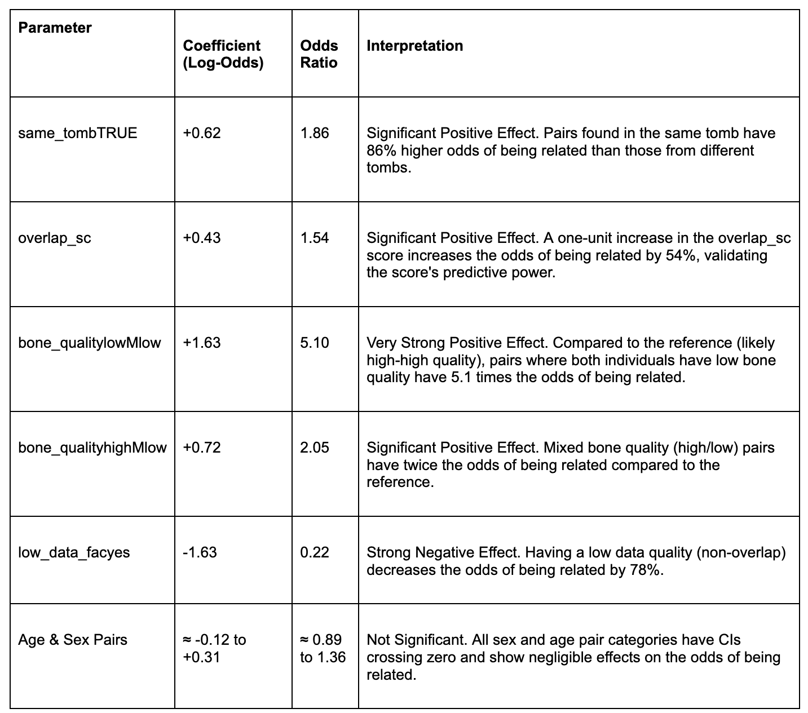

```{r setup, include=FALSE}
source("environmentSetUp.R")
source("Analysis/pairsdata.R")
```

## Outline

**1. Overview & Terminology**

-   Grave Analysis Project\
-   Description of data sets\
-   Research questions

**2. Data Analysis & Statistical Modeling**

-   Data Description
-   Data and Modeling Issues
-   Model

**3. Discussion**

-   Proposal to handle MNAR

## Outline

**1. Overview & Terminology**

-   Grave Analysis Project\
-   Description of data sets\
-   Research questions

[**2. Data Analysis & Statistical Modeling**]{style="color:lightgray;"}\

[**3. Discussion**]{style="color:lightgray;"}\

## Overview of the Project

**Grave Analysis**: How do different factors influence the ratio of relatedness and unrelatedness in a collective tomb from Mycenaean times?

::: {style="text-align: center;"}

:::

## Description of Data sets

**1. Tomb parameters** - Summary information for each tomb:

**Minimum number of individuals (MNI), Number of analysed individuals, Length of use in years, Percentage of successful samples**, Number of total samples, Number of sampled skeletal element: Petrous bones, Teeth, Talus/Phalanx, other

## Description of Data sets

**1. Tomb parameters** - Summary information for each tomb

**2. Individual metadata** - Information of each sampled individual:

-   Analysis ID, Individual ID, Site, 1240k SNPs, Sex, Tomb, Skeletal Element, Age Estimation

## Description of Data sets

**1. Tomb parameters** - Summary information for each tomb

**2. Individual metadata** - Information of each sampled individual

**3. Kinship results:** Pairwise relatedness results between individuals

-   **Kinship coefficient**: Genetic relatedness measure between two individuals
-   **Relation**: Assigned relationship category (1st / 2nd / 3rd degree)
-   **Overlapping SNPs**: Number of shared SNPs used to estimate relatedness
-   **Low data**: Indicator that OverlapNSNPs is below the reliability threshold
-   Pair individuals ID, Upper & lower Z-score, Allele-sharing statistics (mean, unnormalized, standard error of P0), Kinship coefficient CI (min/max), Kinship coefficient min/max

## Special Remarks

-   **Two burial sites**
    -   Amfissa (tholos)
    -   Elateia (chamber tombs): T31, T36, T46, T50, T56, T62, T67\
        **Note:** Analyze T46, T56, and T62 both as a group and as individual tombs
-   **Threshold Rule**
    -   Relationship assignments require minimum SNP overlap:
        -   **1st degree**: ≥ 500 overlapping SNPs
        -   **2nd degree**: ≥ 2,000 overlapping SNPs
        -   **3rd degree**: ≥ 15,000 overlapping SNPs
    -   Pairs below these thresholds are classified as **uncertain**.

## Research Questions

1.  Develop and validate statistical models to predict the **difference between observed and potential relatedness**, using **tomb parameters** (length of use, estimated number of burials, sample success rate) as predictor variables, while accounting for potential confounding factors

2.  Build predictive models to estimate **relatedness** patterns using **individual-level covariates** (sex, age and skeletal element of sample), considering that some of these factors may be confounded with DNA preservation quality and sampling success

## Outline

[**1. Overview & Terminology**]{style="color:lightgray;"}

**2. Data Analysis & Statistical Modeling**

-   Data Description
-   Data and Modeling Issues
-   Model

[**3. Discussion**]{style="color:lightgray;"}

## Data Description

### DAG (**directed acyclic graph)**



## Data Description

### [Absolute relation of MNI and analysed individuals]{style="font-size:26px;"}

{width="70%"}

## Data Description

### [Relative number of skeletal elements by Sex]{style="font-size:26px;"}

{width="70%"}

## Data Description

### [Relative number of skeletal elements by Age]{style="font-size:26px;"}

{width="70%"}

## Data and Modeling Issues

### Tomb-level model

-   Too few data (only 8 tombs)
-   For too many parameters: length of use, \# analysed individuals, effect of 4 types of skeletal elements

$\Rightarrow$ Can not fit a meaningful tomb-level model

## Data and Modeling Issues

### Individual-level model

**1. Unbalanced & sparse Data:**

-   Different sample size in each tombs
-   Some tombs lack certain skeletal elements entirely
-   In some tombs, certain skeletal elements appear only in one sex or one age group

::: fragment
**Solution 1:**

$\Rightarrow$ Collapse many categories of skeletal elements into high-quality bone (petrous bone) and low-quality bone (the rest)
:::

## Data and Modeling Issues

### Individual-level model

**1. Unbalanced & sparse Data**

**2. Across-tomb modeling:**

-   Not only model the pairs with-in one tomb but also **across tombs**
-   Each pair has 2 tomb memberships
-   Relatedness between A and B is influenced by **both** of their tombs

## Data and Modeling Issues

### Individual-level model

**1. Unbalanced & sparse Data**

**2. Across-tomb modeling**

**3. Repeated observation:**

-   Each individual appears in multiple pairs (A-B, A-C, A-D,...)
-   Creates non-independent observations
-   Residual correlation between pairs sharing the same individual
-   Potential bias when individuals have different sampling success or preservation

## Data and Modeling Issues

### Individual-level model

**1. Unbalanced & sparse Data**

**2. Across-tomb modeling**

**3. Repeated observation**

::: fragment
**Solution 2 & 3**

$\Rightarrow$ Multiple membership multiple classification (MMMC) model

-   This accounts for missing category combinations across tombs, cross-tomb structure and controls for repeated measurements on individuals.
-   Add random effects for both 2 tombs and 2 individuals
:::

## Data and Modeling Issues

### Individual-level model

**4. Missing values:**

-   Pairs below certain thresholds of Overlapping SNPs are classified as **uncertain**
-   Missingness Not At Random
-   Data being missing is directly dependent on the value of the target variable (relatedness)

::: fragment
**Current solution 4**

$\Rightarrow$ Only use pairs that has over 15.000 Overlapping SNPs to turn it to MAR.

-   1 more proposal to present in the discussion part
:::

## Model

Let $Y_{ij} = 1$ if individuals $i$ and $j$ are related, and $Y_{t,ij} = 0$ otherwise.

We assume:

$$
Y_{t,ij} \sim \text{Bernoulli}(\pi_{ij})
$$

where $\pi_{ij} = P(\text{related}_{ij} = 1)$.

**Multi-Membership Generalized Linear Mixed Model (MM-GLMM)**

$$
\text{logit}(\pi_{ij}) = \alpha + \mathbf{X}_{ij}^{\top}\boldsymbol{\beta} 
    + \underbrace{(u_i + u_j)}_{\text{Individual MM}} 
    + \underbrace{(v_{T(i)} + v_{T(j)})}_{\text{Tomb MM}}
$$

## Model

$$
\text{logit}(\pi_{ij}) = \alpha + \mathbf{X}_{ij}^{\top}\boldsymbol{\beta} 
    + \underbrace{(u_i + u_j)}_{\text{Individual MM}} 
    + \underbrace{(v_{T(i)} + v_{T(j)})}_{\text{Tomb MM}}
$$ Where:

-   $\alpha$: Global intercept
-   $\mathbf{X}_{ij}$: Covariate vector
-   $u$: RE for Individual with $u \sim \mathcal{N}(0, \sigma^2_{\text{ind}})$
-   $v$: RE for Tomb with $v \sim \mathcal{N}(0, \sigma^2_{\text{tomb}})$

## Model

### Variables

```{r variables, echo=FALSE}
pairs_ind_show <- pairs_ind |>
  select(related_binary, sex_pair, age_pair, bone_quality, same_tomb, individual1_id, individual2_id, tomb1, tomb2)

set.seed(45454)
pairs_ind_show |>
  slice_sample(n = 20) |>
  slice(11:20) |>
  gt() |>
  tab_header(
    title = "Variables in the model"
  )
```

-   Use r library "brms" (Bayesian Regression Models using 'Stan')
-   One version for all separated tombs
-   One version with Tomb 46, 56, 62 grouped as 1 tomb

## Model

### Separated tombs

```{r mod sep, echo=FALSE, out.height="500px"}
imp_binary_separate_cat <- readRDS("unofficial work/models save/imp_binary_separate_cat.rds")
imp_binary_separate_cat
```

## Model

### Grouped tombs

```{r mod group, echo=FALSE, out.height="500px"}
imp_binary_group_cat <- readRDS("unofficial work/models save/imp_binary_group_cat.rds")
imp_binary_group_cat
```

## Model

### Sampling health (Diagnostic)

**1. R-hat**

-   Both model: 1.00

$\Rightarrow$ Very good. 4 different simulation chains have converged to the exact same result.

## Model

### Sampling health (Diagnostic)

1.  R-hat: very good

::: fragment
**2. Divergent transitions**

-   Both model: 0

$\Rightarrow$ Perfect. Zero cases of divergence.
:::

## Model

### Sampling health (Diagnostic)

1.  R-hat: very good
2.  Divergent transitions: 0

::: fragment
**3. Effective sample size**

-   Separated model: Bulk ESS \> 4800; Tail ESS \> 6000
-   Grouped model: Bulk ESS \> 4800; Tail ESS \> 5200

$\Rightarrow$ Extremely high number of independent samples. Indicate reliable estimates and boundaries.
:::

## Model

### Sampling health (Diagnostic)

1.  R-hat: very good
2.  Divergent transitions: 0
3.  Effective Sample Size: extremely high

$\Rightarrow$ The model is healthy and reliable.

## Model

### Interpretation

In logistic regression, $\beta$ are given in Log-Odds

$\Rightarrow$ Interpret as $\text{Odds Ratio} = e^{\beta}$

{fig-align="center" width="90%"}

## Outline

[**1. Overview & Terminology**]{style="color:lightgray;"}

[**2. Data Analysis & Statistical Modeling**]{style="color:lightgray;"}

**3. Discussion**

-   Proposal to handle MNAR
-   Modeling Overlap SNPs

## Proposal to handle MNAR

### Background: MNAR in Kinship Data

-   Relatedness labels become *uncertain* when overlap SNP is lower than the given threshold
-   Thresholds depend on degree (1st/2nd/3rd)
-   Missingness is **Missing Not At Random**

## Proposal to handle MNAR

### Statistical reasoning 

**From the statistical reference we use:**\
"If missingness depends on an auxiliary variable Z, then including Z in the model makes the missing-data mechanism satisfy MAR instead of MNAR."

In this case:

-   Z = overlap_snps (continuous data-quality variable)
-   low_data = threshold flag (encoding whether the overlap is insufficient for that degree)

::: Fragment
=\> **Include both overlap and low_data in the relatedness model**
:::

## Proposal to handle MNAR

### **Used** model **and data:**

-   Multi-Membership Generalized Linear Mixed Model(MM-GLMM) with random effects for both 2 tombs and 2 individuals
-   Use the whole data without marking anything uncertain

## Outline

[**1. Overview & Terminology**]{style="color:lightgray;"}

[**2. Data Analysis & Statistical Modeling**]{style="color:lightgray;"}

**3. Discussion**

[- Proposal to handle MNAR]{style="color:lightgray;"}

\- Modeling Overlap SNPs

## Modeling Overlap SNPs

### Motivation

Archaeological and biological factors influencing DNA preservation:

-   skeletal element

-   tomb sample success and length of use

-   age and sex

DNA Preservation Factors → Overlap SNPs → Uncertainty in Relatedness

::: fragment
Therefore:

-   **Overlap is the key data-quality variable**

-   It triggers uncertainty (MNAR) in kinship labels
:::

## Modeling Overlap SNPs

### Model

Gaussian GLM with an identity link

$$
\mathbb{E}[\text{Overlap}_{ij}] 
= \alpha + \mathbf{X}_{ij}^{\top}\boldsymbol{\beta},
\qquad 
\text{Overlap}_{ij} \sim \mathcal{N}(\mu_{ij},\sigma^2).
$$

::: fragment
GLM was chosen because:

-   outcome is continuous

-   predictors are a mix of categorical and numeric

-   interpretation is straightforward
:::

## Modeling Overlap SNPs

### Model

```{r mod ov, echo=FALSE, warning=FALSE, out.height="500px"}
m_overlap <- readRDS("unofficial work/models save/m_overlap_glm.rds") 
m_overlap
```

## Modeling Overlap SNPs

### Interpretation

1.  Lower bone quality -\> low overlap

2.  Higher tomb sampling success -\> better overlap

3.  Subadults -\> higher overlap

4.  Same tomb -\> negligible influence

    ::: fragment
    $\Rightarrow$ Overlap NSPs is mainly driven by bone quality and tomb-level sampling success
    :::

## Sources

Multiple membership model:

<https://journals.sagepub.com/doi/epdf/10.1177/1471082X0100100202>

<https://www.youtube.com/watch?v=ob-VAapo3w4>

GLMM:

<https://stats.stackexchange.com/questions/626546/how-does-lme4-handle-participants-who-only-have-data-for-only-one-level-of-a-cat>

<https://www.tjmahr.com/plotting-partial-pooling-in-mixed-effects-models/>

Variable Z in MNAR:

<https://arxiv.org/pdf/2404.04905>

brms library:

<https://mc-stan.org/learn-stan/diagnostics-warnings.html>

<https://easystats.github.io/bayestestR/reference/effective_sample.html>

## Appendix

### Proposal to handle MNAR: Model

```{r mod r, echo=FALSE, warning=FALSE, out.height="500px"}
m_related <- readRDS("unofficial work/models save/m_related1.rds") 
m_related
```

## Appendix

### Proposal to handle MNAR: Sampling health (Diagnostic)

-   **R-hat ≈ 1.00 or 1.01** → chains mixed well

-   **Bulk ESS, Tail ESS reasonable** → stable posterior estimates

-   **Very few divergent transactions** → sampler explored geometry correctly

    ::: Fragment
    $\Rightarrow$ The diagnostics indicate reliable posterior estimation.
    :::

## Appendix

### Proposal to handle MNAR: Interpretation



## Appendix

### Proposal to handle MNAR: Interpreting the Low Bone Quality Coefficient

-   **Logically**, and as confirmed by our Overlap Model,

    -   good-quality bone → **higher** overlap

    -   low-quality bone → **lower** overlap

-   However, in the Relatedness Model, **low bone quality shows a positive coefficient**.

::: fragment
**Why?**

This is a **conditional statistical effect**, not a biological one.

-   Because **overlap_sc is already included in the model**, it absorbs the main effect of DNA preservation.

-   After adjusting for overlap, **bone quality no longer represents DNA quality**.

-   Instead, its remaining variation correlates with other factors in the dataset

    (e.g., specific tombs or individuals that happen to contain more relatives).
:::

## Appendix

### Proposal to handle MNAR: Conclusion

This model provides a statistically valid way to address the MNAR mechanism in our dataset and yields reliable estimates of relatedness under realistic archaeological and technical conditions.
