---
output:
  pdf_document:
    latex_engine: xelatex
    toc: false
    toc_depth: 3
    number_sections: true
    fig_caption: true
    highlight: tango
    keep_tex: false

fontsize: 12pt
geometry: margin=2.5cm

bibliography: references.bib
link-citations: true
colorlinks: true
linkcolor: blue
citecolor: blue
urlcolor: blue

header-includes:
  - \usepackage{booktabs}
  - \usepackage{longtable}
  - \usepackage{hyperref}
  - \usepackage{fancyhdr}
  - \pagestyle{fancy}
  - \fancyhead{} 
  - \fancyhead[L]{\leftmark} 
  - \fancyhead[R]{Grave Analysis}
  - \usepackage{tocloft}
  - \usepackage{etoolbox}
  - \pretocmd{\tableofcontents}{\clearpage}{}{}
  - \usepackage{float}
---

\begin{titlepage}
\begin{center}
\vspace*{1cm}

% --- Double Lines & Title ---
\rule{\linewidth}{1.5pt} \\[-0.8em]
\rule{\linewidth}{0.5pt} \\[1.5em]

{\LARGE \bfseries Grave Analysis: How do different factors influence the ratio of relatedness in a collective tomb from Mycenaean times?\par}
\vspace{1em}

\rule{\linewidth}{0.5pt} \\[-0.8em]
\rule{\linewidth}{1.5pt}

\vspace{1.5cm}


{\Large Advanced Practical Project - WS 25/26 LMU Munich\par}

\vspace{3cm}


\setlength{\tabcolsep}{1.5cm}  
\begin{tabular}{cc}
\large Arsine Chinaryan & \large Anh Hoang Minh Dang \\
\small \href{mailto:Arsine.Chinaryan@campus.lmu.de}{Arsine.Chinaryan@campus.lmu.de} & \small \href{mailto:An.Dang@campus.lmu.de}{An.Dang@campus.lmu.de} \\[2em]
\large Felicia Francis Immanuel & \large Margarita Khachatryan \\
\small \href{mailto:Felicia.Immanuel@campus.lmu.de}{Felicia.Immanuel@campus.lmu.de} & \small \href{mailto:M.Khachatryan@campus.lmu.de}{M.Khachatryan@campus.lmu.de}
\end{tabular}

\vfill 

\textbf{Institution:} Institute of Statistics\\
\textbf{Supervisor:} Yichen Han \\
\textbf{Project Partners:} Irene Högner \& Alissa Mittnik  
(Max Planck Institute for Evolutionary Anthropology, Department of Archaeogenetics) \\    
\textbf{Research Area:} Pre- and Early History Archaeology (ERC Project “MySocialBeIng”) \\
\vspace{1cm}
{\large 2026-03-08 \par}

\end{center}
\end{titlepage}


# Abstract {-}

This study investigates genetic relatedness patterns among individuals buried in collective tombs from Mycenaean Greece using ancient DNA data from the sites of Amfissa and Elateia. Pairwise kinship relationships were inferred from genome-wide SNP data using the READv2 software and classified into degrees of biological relatedness. Because kinship inference depends strongly on genomic coverage, pairs with fewer than 15,000 overlapping SNPs were excluded to improve classification reliability and reduce bias associated with data quality. The resulting pairwise dataset exhibits complex dependency structures, as individuals appear in multiple comparisons and pairs may involve individuals from different tombs. To account for these dependencies, we implemented a Bayesian Multi-Membership generalized linear mixed model in which each observation is simultaneously associated with two individuals and their corresponding tombs. The model evaluates how biological and contextual factors influence the probability of detected relatedness. The results show that shared burial context is the strongest predictor of biological relatedness, with pairs from the same tomb having substantially higher probabilities of kinship. In addition, Male-Male pairs and pairs of Subadults display higher probabilities of relatedness compared to other demographic combinations. Robustness checks confirm that these patterns remain stable under alternative model specifications and definitions of relatedness. Overall, the study demonstrates how hierarchical modeling approaches can be applied to archaeogenetic data to account for non-independence, data quality constraints, and complex burial structures.

\newpage

\tableofcontents

\newpage

# Introduction
Understanding patterns of biological relatedness within collective burial contexts can provide important insights into the social organization of past societies. In Mycenaean Greece (ca. 1500–1000 BCE), collective tombs were used over long periods and often contain the remains of many individuals. Archaeologists have long debated whether these tombs represent biological family groups, broader kin networks, or socially defined communities. Only recently has ancient DNA (aDNA) analysis made it possible to examine these questions directly.

```{r fig0, echo=FALSE, fig.cap="Selected tombs at Elateia", fig.pos='H', out.width="100%"}
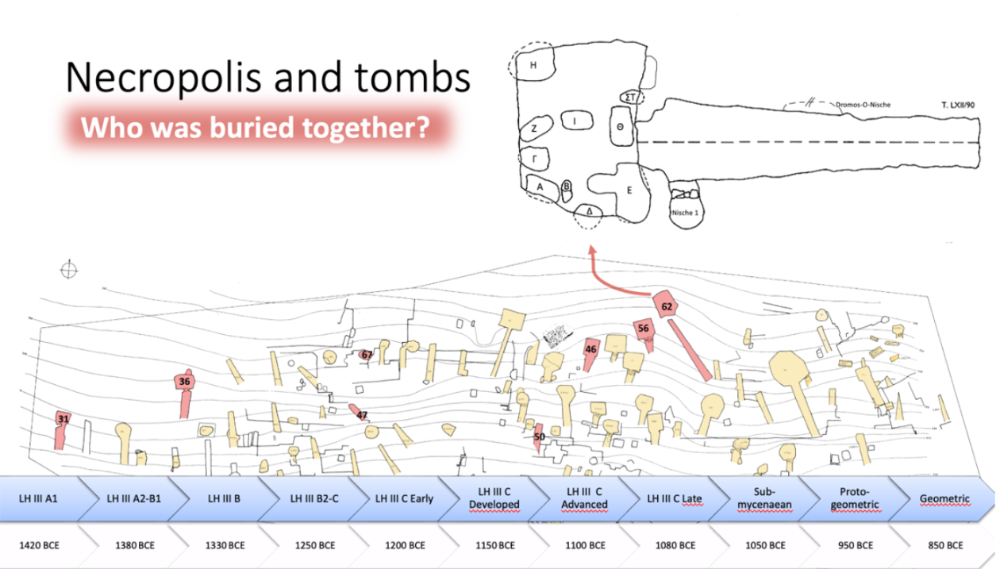
```

The present study investigates patterns of genetic relatedness among individuals buried in collective tombs from the Mycenaean sites of Amfissa and Elateia. Genetic data from skeletal remains allow the identification of biological relationships between individuals and provide a new way to study how people buried in the same tomb were connected.

However, analyzing relatedness in this context presents several challenges. Archaeological sampling is selective, meaning that only a subset of individuals from each tomb is genetically analyzed. In addition, DNA preservation varies across individuals and skeletal elements, which affects the quality of the genetic data. As a result, some relationships may be harder to detect than others. Furthermore, the data have a complex structure because relatedness is observed for pairs of individuals, and each individual can appear in multiple pairwise comparisons.

\newpage

The statistical analysis in this study was guided by research questions formulated by our project partners. In particular, they were interested in both tomb-level and individual-level patterns of relatedness. At the tomb level, the goal was to examine whether relatedness patterns differ between burial contexts and whether characteristics such as the duration of tomb use, the number of burials, or sampling success might influence these patterns. At the individual level, the focus was on whether biological and sampling-related characteristics, such as sex, age category, or the sampled skeletal element, are associated with detected relatedness.

Overall, the aim of the study is to evaluate how relatedness patterns vary across burial contexts while accounting for potential sources of bias in the data. By combining archaeogenetic data with modern statistical modeling approaches, this work contributes to a better understanding of social organization in Mycenaean collective burials.

\newpage

# Data and Methods
## Data Description 
This project is based on genetic and osteological data obtained from human remains recovered from Mycenaean collective burial contexts in Greece, dated to approximately 1500–1000 BCE. The material derives from two archaeological sites: Amfissa, which consists of a single tholos tomb, and Elateia, a large burial site containing 85 tombs. From Elateia, seven tombs were selected for detailed genetic investigation, namely tombs 31, 36, 46, 50, 56, 62, and 67. DNA preserved in skeletal material was extracted and analyzed to infer biological relationships among individuals buried within and between tombs.

The analysis draws on three interconnected datasets that capture information at different levels of resolution. One dataset summarizes characteristics at the tomb level. It includes variables such as the minimum number of individuals identified, the number of individuals successfully analyzed genetically, the estimated duration over which the tomb was used, the proportion of successful DNA samples, the total number of samples taken, and the distribution of sampled skeletal elements (including petrous bones, teeth, talus or phalanx, and other elements). These variables highlight differences between tombs in preservation, sampling, and burial practices.

A second dataset contains metadata describing the sampled individuals. Each entry represents a single individual and records the associated tomb, estimated biological sex, age category, and the skeletal element used for DNA extraction. This information provides the biological and contextual background necessary to evaluate how individual characteristics relate to genetic data quality and inferred relationships.

The third dataset reports pairwise genetic relationships between individuals based on ancient DNA analyses. For each pair, it includes estimates of genetic relatedness, the number of overlapping single nucleotide polymorphisms (SNPs), and a categorical classification of relationship degree following established criteria. Since individuals can be involved in multiple pairwise comparisons, observations in this dataset are not independent, resulting in a complex relational structure.

## READv2 Software
### Classification Procedure and Overlap Requirements
Genetic relatedness between individuals was inferred using READv2 (Relationship Estimation from Ancient DNA) [[@alaccamli2024readv2]], which estimates pairwise relatedness from genome-wide patterns of allele mismatches. The method computes the proportion of non-matching alleles (P0) across overlapping SNPs between two individuals and classifies relationships based on normalized P0 thresholds. These thresholds split pairs into four categories: unrelated, third-degree, second-degree, and first-degree relatives.

```{r fig1, echo=FALSE, fig.cap="READv2 classification process", fig.pos='H', out.width="100%"}
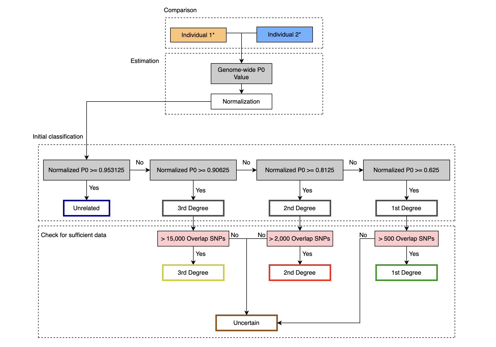
```

Because the precision of the P0 estimate depends directly on the number of overlapping SNPs, READv2 incorporates minimum overlap requirements to ensure sufficient data for each degree of relatedness. According to the documentation [@alaccamli2024readv2], the recommended thresholds are 500 overlapping SNPs for first-degree, 2,000 for second-degree, and 15,000 for third-degree relationships. Pairs falling below these thresholds are considered insufficiently informative and are labeled as uncertain.
This two-step procedure, initial classification based on normalized P0 followed by validation through minimum SNP overlap thresholds, reflects the fundamental dependence of kinship inference on data quantity. Relationship labels are therefore conditional not only on genetic similarity but also on genomic coverage.

### False Positive Rates and Classification Power
The reliability of READv2 classifications has been evaluated in the original methodological validation studies [@alaccamli2024readv2]. In particular, true positive rates (TPR) and false positive rates (FPR) were assessed across different coverage levels and degrees of relatedness.

```{r fig3, echo=FALSE, fig.cap="The power (i.e., the proportion of correctly classified pairs) and false positive rates (proportion of unrelated pairs classified into the respective degree) of READv2 assignment using simulated first-degree (n=118), second-degree (n=150), and third-degree pairs (n=144). The analyses were performed using varying window sizes (1 Mb, 5 Mb, 20 Mb, Whole genome), and also using varying coverages (0.01×, 0.05×, 0.1×, 0.2×, 0.3×, 0.4×, 0.5×, 1×, 5×) that correspond to the number of overlapping SNPs in the simulated dataset", fig.pos='H', out.width="100%"}
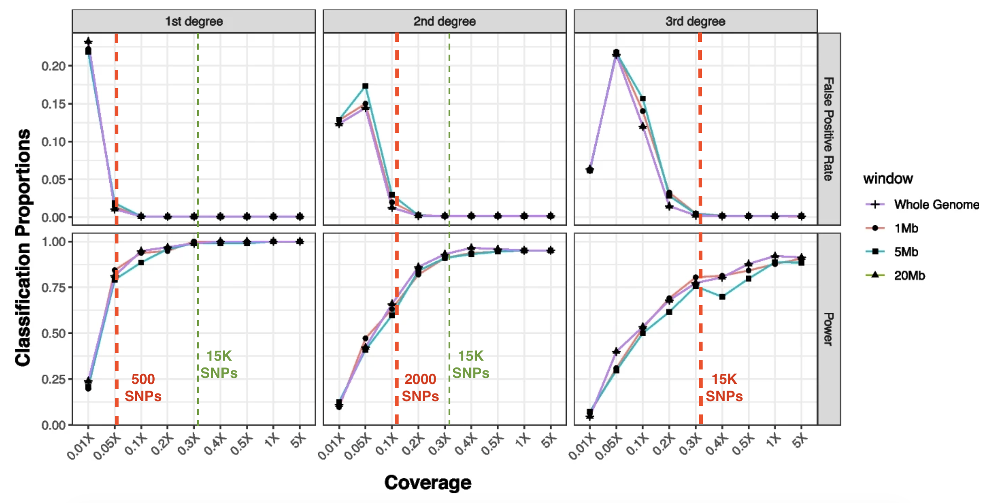
```

As shown in Figure 2, classification accuracy is strongly dependent on genome coverage. At low coverage levels, false positive rates increase substantially, particularly for third-degree relationships. On the contrary, the power to correctly identify true relatives rises sharply as the number of overlapping SNPs increases.

For all degrees of relatedness, performance stabilizes once overlap approaches approximately 15,000 SNPs. Beyond this level, both false positive rates decline toward zero and true positive rates approach one, indicating reliable differentiation between related and unrelated pairs. Below this range, however, classifications are noticeably less stable.

These documented performance metrics demonstrate that relationship labels produced by READv2 cannot be interpreted independently of data quantity. Low overlap reduces statistical power and increases misclassification risk, especially for more distant degrees of relatedness.

### Empirical Precision of the P0 Estimator
To further investigate the dependence of classification stability on overlap size, we examined the empirical precision of the P0 estimator in our dataset. Specifically, we computed the coefficient of variation (CV) of the non-normalized P0 estimate, defined as

$$
CV_{\hat{p}_0} =
\frac{\operatorname{SE}\!\left(\hat{p}_0^{\mathrm{non\text{-}norm}}\right)}
{\hat{p}_0^{\mathrm{non\text{-}norm}}}
$$

The coefficient of variation provides a scale-independent measure of relative estimation error and thus serves as a direct indicator of classification stability.

```{r fig4, echo=FALSE, fig.cap="Empirical precision of P0 vs. overlapping SNPs", fig.pos='H', out.width="100%"}
knitr::include_graphics("../Plots/plot_p0_overlap.png")
```

Figure 3 shows a noticeable inverse relationship between overlap size and relative estimation error. For pairs with fewer than approximately 1,000 overlapping SNPs, the CV is high and highly variable, indicating substantial uncertainty in P0 estimation. As the number of overlapping SNPs increases, the CV declines rapidly and stabilizes at low levels. Around 15,000 overlapping SNPs, the relative error becomes minimal and exhibits little variability across pairs.

This empirical pattern closely mirrors the performance results reported in the methodological validation studies. Together, they indicate that overlap size is a primary determining factor of classification reliability. While READv2 defines degree-specific minimum thresholds, the convergence of both documented TPR/FPR behavior and empirical CV stabilization around 15,000 SNPs suggests that beyond this value, statistical precision improves markedly across all degrees of relatedness.
For this reason, the 15,000 SNP threshold plays a central role in our subsequent filtering strategy and interpretation of relatedness patterns.

## Data Visualization
### DAG {#dag-section}
To formalize the assumed data-generating mechanism underlying observed kinship classifications, we constructed a directed acyclic graph (DAG) representing the causal relationships among biological, archaeological, and technical variables (Figure 4). The DAG clarifies pathways of influence, identifies potential confounding structures, and differentiates between latent biological processes and measurement-related mechanisms. [@Pearl2009]

```{r fig5, echo=FALSE, fig.cap="Directed Acyclic Graph (DAG)", fig.pos='H', out.width="100%"}
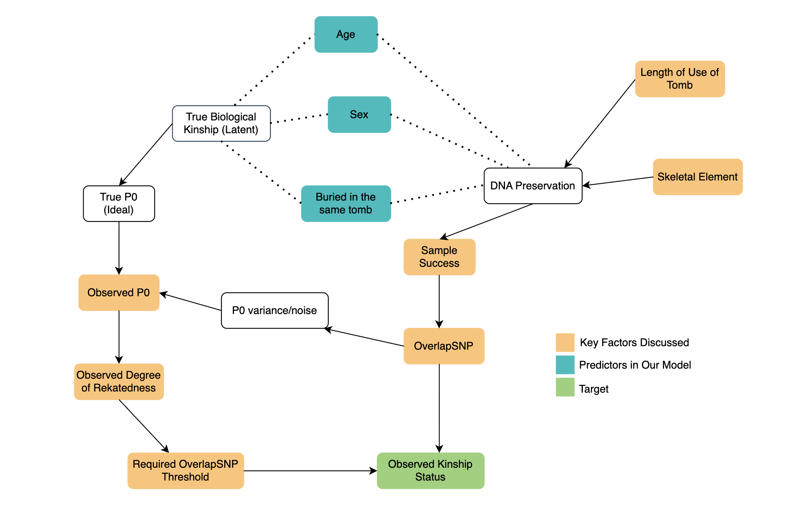
```

At the core of the structure lies true biological kinship, which is unobserved (latent). True kinship determines the ideal genetic mismatch rate (true P0), which would be observed in the absence of measurement error. The observed P0 value is then obtained through a measurement process that introduces variance depending on data quality and SNP overlap. A degree of relatedness is then assigned based on the observed P0 and the required SNP overlap thresholds.[@MonroyKuhn2018]

DNA preservation lies at the center of this structure. Preservation quality affects sample success and the number of overlapping SNPs available for comparison. Overlap size directly influences the variance of the P0 estimator and thus the reliability of kinship classification.
Several factors influence DNA preservation.[@Orlando2021] At the tomb level, the length of use may affect environmental exposure and long-term degradation processes. At the individual level, the sampled skeletal element affects DNA yield, as certain elements (e.g., petrous bone) are known to preserve DNA more effectively than others. [@Pinhasi2015]

Age and sex are included as biological characteristics potentially associated with burial patterns, kinship structure, and bone preservation [@bello2006age], [@pohl2023can]. These variables are modeled as predictors of observed kinship patterns rather than determinants of DNA quality, although indirect pathways may exist.
Importantly, the DAG distinguishes between:

- Biological structure (true kinship),
- Measurement processes (DNA preservation, Overlapping SNP, P0 variance),
- And classification rules (SNP overlap thresholds).

This separation clarifies that observed kinship status is not a direct observation of biological relatedness, but the result of a multi-stage process involving biological, archaeological, and technical components.

The DAG provides a conceptual foundation for the modeling strategy adopted in following sections by clearly separating biological structure from measurement processes. In particular, it highlights that tomb-level characteristics, such as length of use, and sampling-related factors influence observed kinship classifications primarily through their effect on DNA preservation and SNP overlap rather than directly on biological relatedness. This distinction is essential, as observed kinship status reflects both underlying biological relationships and the constraints imposed by data quality. The modelling approach presented later is based on this structure and accounts for the dependencies inherent in pairwise observations.

### Descriptive Plots
To obtain an initial overview of kinship patterns across burial sites, we analysed both the absolute number and the proportion of within-tomb pairs by relationship category (realted, unrelated, uncertain) (Figures 1 and 2).

The following descriptive results are based on the degree-specific SNP overlap thresholds recommended in the READv2 documentation ($\ge500$ SNPs for first-degree, $\ge2,000$ for second-degree, and $\ge15,000$ for third-degree relationships).

**Absolute Number of Within-Tomb Pairs**

Figure 5 shows the absolute number of within-tomb pairs classified as related, unrelated, or uncertain. As expected, the total number of pairs varies substantially across tombs, reflecting differences in sample size.

```{r fig6, echo=FALSE, fig.cap="Absolute number of within-tomb Pairs by relationship category", fig.pos='H', out.width="100%"}
knitr::include_graphics("../Plots/p_within_abs.png")
```

Amfissa shows the largest number of within-tomb pairs, reflecting the comparatively large number of sampled individuals. In contrast, Elateia Tomb 31 and 67 contain only a small number of individuals and therefore yield very few pairs overall; in both tombs, only a single related pair is identified.

At the request of the project partner, Elateia Tombs 46, 56, and 62 were analyzed both separately and jointly. Archaeologically, these three tombs are spatially close and have been hypothesized to represent interconnected burial contexts. When examined individually, each tomb yields a moderate number of pairs. However, when the three tombs are considered together, the total number of pairs increases substantially and exceeds the simple sum of the three separate counts. This increase occurs because grouping the tombs introduces additional cross-tomb pairs between individuals buried in different tombs among the three. The marked rise in total pairs therefore reflects potential connections across tomb boundaries rather than merely larger sample size.

Across all tombs, unrelated pairs constitute the majority of observations in absolute terms, while confidently classified related pairs remain comparatively rare.

**Proportion of Within-Tomb Pairs**

To account for differences in tomb size, Figure 6 presents the proportion of within-tomb pairs by relationship category.

```{r fig7, echo=FALSE, fig.cap="Proportion of within-tomb pairs by relationship category", fig.pos='H', out.width="100%"}
knitr::include_graphics("../Plots/p_within_rel.png")
```

Across most tombs, the proportion of related pairs is low, typically below five percent. The majority of comparisons fall into the unrelated or uncertain categories. 

Two tombs exhibit comparatively higher proportions of related pairs. However, in the case of Elateia Tomb 31, the high number of 10% must be interpreted cautiously, as the total number of pairs in this tomb is very small, with only one related pair. Proportions in small samples are inherently unstable and can appear inflated due to limited denominators.
Overall, the descriptive patterns indicate that close biological relatedness represents a minority of pairwise relationships within tombs. At the same time, substantial variation exists across burial contexts, both in the total number of comparisons and in the proportion of related pairs.


### Kinship Network
To further explore the structure of biological relationships, kinship networks were constructed based on the READv2 classifications. Nodes represent individuals and edges represent first-, second-, or third-degree relationships.

\clearpage

**All Tombs Combined**

```{r fig8, echo=FALSE, fig.cap="Network representing all relationships (Cross-tomb and within-tomb) in all tombs", fig.pos='H', out.width="100%"}
knitr::include_graphics("../Plots/All_Tombs_network.png")
```
When all tombs are considered together, the network forms several larger connected components. Many of these clusters are centered around male individuals, who often occupy central positions and link multiple relatives. In several cases, a male individual connects otherwise separate subgroups, effectively holding clusters together.

Cross-tomb relationships are frequent in the combined network. In contrast, dense within-tomb clusters are less common. This suggests that biological relatedness is not strictly confined to single burial contexts but extends across tomb boundaries.

\clearpage

**Amfissa Tholos**

```{r fig9, echo=FALSE, fig.cap="Network representing all relationships (Cross-tomb and within-tomb) in Amfissa Tholos", fig.pos='H', out.width="100%"}
knitr::include_graphics("../Plots/Amfissa_Tholos_network.png")
```

The Amfissa network shows one of the most cohesive structures. A large cluster is visible, again centered around a small number of male individuals. Several relatives connect to these central nodes across different degrees of relatedness, forming extended family structures rather than isolated pairs.

\clearpage

**Grouped Elateia Tombs (T46, T56, T62)**

```{r fig10, echo=FALSE, fig.cap="Network representing all relationships (Cross-tomb and within-tomb) in grouped Elateia Tombs (T46, T56, T62)", fig.pos='H', out.width="100%"}
knitr::include_graphics("../Plots/Elateia_T46_56_62_network.png")
```

When Tomb 46, 56, and 62 are analyzed jointly, the network becomes notably interconnected. As observed in the descriptive statistics, grouping these tombs introduces many cross-tomb links. The network visualization clearly reflects this pattern: individuals from the three tombs are frequently connected, and several central nodes link members across burial contexts.
This supports the earlier observation that these tombs are not independent units but appear to share biological connections.

**Other Tombs**

In the remaining tombs, the networks are generally smaller and more fragmented. Most consist of small clusters of related individuals connected by one or two ties. Cross-tomb links are again visible in several cases, while strong within-tomb clustering is limited.

\clearpage

**Interpretation**

Across all visualizations, related individuals tend to cluster around male nodes, while female individuals more often appear at the periphery of clusters. This pattern is consistent with archaeogenetic interpretations of patrilocal social organization, in which males remain within their natal community and females more frequently marry outside the group [@moutafi2015towards]; [@Boyd2016]. While the present analysis does not formally test this hypothesis, the network structure aligns with such interpretations.

## Limitations
### Tomb-level model not possible
While the project partners initially expressed interest in modeling tomb-level effects explicitly, for example by including tomb-level covariates such as length of use, number of analyzed individuals, or characteristics of skeletal preservation. Such a model is not statistically viable with the available data.

With only eight independent burial units (Amfissa and seven tombs from Elateia), there is not enough  information to reliably estimate multiple tomb-level predictors. In inferential statistics, attempting to fit several parameters to such a small number of groups would result in a severely underpowered model prone to overfitting. Consequently, this analysis restricts the modeling framework to individual- and pair-level data to ensure the reliability of the findings.


### Missing Data Mechanism (MNAR)
A fundamental challenge in kinship analysis is the "uncertain" classification of pairs. In the READv2 procedure, a pair is only classified if the number of overlapping SNPs (OSNP) meets specific thresholds (500, 2,000, or 15,000), depending on the degree of relatedness.

Originally, the probability of a pair being classified (denoted by the indicator $R$) depends on its true, unobserved kinship status ($X_M$). In missing data theory, this is defined as Missing Not At Random (MNAR):

$$P(R \mid X_O, X_M) \text{ depends on } X_M$$
where $X_O$ represents observed data quality. Because the threshold for classification changes based on the degree of the relationship, the "missingness" is tied directly to the outcome we are trying to model. Standard statistical inferences are generally invalid under MNAR because the missing data is biased toward specific results.

To resolve this, we apply a uniform threshold of 15,000 SNPs for all pairs. By using a single, high standard for all degrees of relatedness, the classification $R$ becomes a deterministic function of the observed DNA quality rather than the kinship itself:

$$
R = \mathbb{I}\!\left(\mathrm{OSNP} \ge 15{,}000\right)
$$

This shift transforms the mechanism into Missing At Random (MAR), where missingness depends only on the observed overlap (X_O): 

$$P(R \mid X_O, X_M) = P(R \mid X_O)$$

## Data Preparation for Model
Prior to statistical modeling, the raw datasets were processed and integrated to obtain consistent pairwise datasets suitable for analysis. Data preparation involved filtering relevant observations, combining information across different levels, and constructing derived variables required for modeling.

At the individual level, metadata were first restricted to the burial sites and tombs included in the analysis. Individuals from Lapoutsi were excluded, and only samples from Amfissa tholos and selected tombs at Elateia were retained. Age estimates were then simplified by combining unclear or overlapping categories into two broad groups, namely "Subadult" and "Adult or Undefined", to ensure sufficient sample sizes per category.

To allow analyses at different spatial resolutions, as requested by the project partners, an additional set of tomb-level parameters was constructed in which Tombs 46, 56, and 62 at Elateia were treated as a single combined burial unit. Corresponding values for this grouped tomb were derived from the original data and added alongside the individual tomb records.

Pairwise genetic kinship data were processed to construct the main analytical datasets. Relationship classifications were first cleaned by distinguishing confidently assigned relationships from uncertain cases. Pairs with insufficient genetic information were marked as uncertain, and a binary indicator of relatedness (related vs. unrelated) was derived while excluding these uncertain observations. To address potential MNAR patterns due to low SNP overlap, the primary outcome variable was defined using a stricter minimum SNP overlap threshold of 15,000

Individual-level metadata were merged into the kinship dataset for both members of each pair, adding information on tomb affiliation, sex, age category, and sampled skeletal element. Two analytical datasets were then constructed. The first retains the original tomb structure, with Tombs 46, 56, and 62 treated separately. The second duplicates pairs involving individuals from these tombs and reassigns them to a combined tomb category.

Finally, both datasets were augmented with tomb-level characteristics by linking each individual’s tomb to the corresponding sampling success, number of analyzed individuals, and length of use. Additional pair-level variables were constructed to describe sex composition, age composition, shared tomb membership, combined skeletal element types, and an indicator of bone quality based on the presence of petrous bone samples.
The resulting datasets consist of pairwise observations enriched with individual- and tomb-level information. They form the basis for the multi-membership models used in the subsequent analysis.

## The Multi-Membership Generalized Linear Mixed Model 
### Model Definition and Motivation
To analyze the kinship patterns within the dataset, we require a modeling framework that can account for the inherent dependencies within our observations. In this study, an observation is defined as a pair of individuals $(i,j)$, where the response variable $Y_{ij}$ indicates whether the pair shares a biological relationship.

**Motivation: The Complexity of Pairwise Data**

The data structure presents two primary challenges that traditional regression models cannot handle:
Multiple Membership of Individuals: Each individual appears in multiple pairs. For example, if individual $i$ is compared to $j$, $k$, and $l$, the errors associated with those three observations will be correlated because they all share the unique genetic and environmental traits of individual $i$.
Tomb-Level Dependencies: Pairs can exist both within the same tomb or across different tombs. Because individuals within a tomb may share common environmental or social factors, we must account for the random "tomb effect." A pair ${i,j}$ effectively "belongs" to the tombs $T(i)$ and $T(j)$.

To address this, we utilize a Multi-Membership Generalized Linear Mixed Model (MM-GLMM). This model is specifically designed for cases where an observation does not belong to a single cluster, but rather "members" multiple clusters (in our case, two individuals and two tombs) simultaneously [@browne2001multiple].

**Model Definition**

Let $Y_{ij}$ be a binary indicator where $Y_{ij} = 1$ if individuals $i$ and $j$ are related, and $Y_{t,ij} = 0$ otherwise. We assume $Y_{ij}$ follows a Bernoulli distribution:

$$
Y_{t,ij} \sim \text{Bernoulli}(\pi_{ij})
$$

where $\pi_{ij} = P(\text{related}_{ij} = 1)$ is the probability of a relationship existing between the pair. We model this probability using a logit link function to accommodate the complex random effects structure:

$$
\text{logit}(\pi_{ij}) = \alpha + \mathbf{X}_{ij}^{\top}\boldsymbol{\beta} 
    + \underbrace{(w_i u_i + w_j u_j)}_{\text{Individual RE}} 
    + \underbrace{(w_{T(i)} v_{T(i)} + w_{T(j)} v_{T(j)})}_{\text{Tomb RE}}
$$

Components of the Model:

-   $\alpha$: The global intercept, representing the baseline log-odds of two individuals being related.
-   $\mathbf{X}_{ij} \beta$: The fixed effects component, where $\mathbf{X}_{ij}$ contains pair-level covariates.
-   $u_i, u_j$: Random effects for the two individuals, where $u \sim \mathcal{N}(0, \sigma^2_{\text{ind}})$
-   $v_{T(i)}, v_{T(j)}$: Random effects for the tombs associated with individuals $i$ and $j$, where $v \sim \mathcal{N}(0, \sigma^2_{\text{tomb}})$
-   $w$: Weights assigned to the random effects. Following standard multi-membership notation [@browne2001multiple], we set equal weights $w_i = w_j = 0.5$ and $w_{T(i)} = w_{T(j)} = 0.5$. This ensures that the total variance contributed by the individual or tomb level remains consistent and equal.

### Fitting the Model with brms
Following the theoretical definition of the MM-GLMM, this section details the practical implementation, predictor selection, and the Bayesian framework used for estimation.

**Predictor Selection and the Causal Framework**

The selection of covariates is guided by the Directed Acyclic Graph (DAG) presented in Section [Section 2.3.1 DAG](#dag-section). To estimate the probability of relatedness, we focus on variables situated along the social, biological branches of our causal model. Specifically, the following predictors are included in the model: Pairwise Sex Combination, Pairwise Age Category, and Same Tomb Indicator.

Notably, DNA preservation variables (Number of Overlapping SNPs, Analyzed skeletal element,...) are excluded from the model. While preservation significantly influences data quality and the initial ability to identify SNPs, it does not exert a causal influence on true biological relatedness itself. Because a rigorous quality filter, a 15,000 SNP threshold, was applied during data preprocessing, the influence of preservation bias is effectively mitigated. Once a pair meets this threshold, variation in kinship outcomes is no longer explained by preservation quality. 

**Bayesian Implementation via brms**

The model is fitted using the brms package in R. The brms package acts as an interface to Stan, utilizing Hamiltonian Monte Carlo (HMC) algorithms to perform Bayesian inference. This approach is particularly robust for Multi-Membership models, as it allows for flexible specification of complex random effect structures that often struggle to estimate using frequentist Maximum Likelihood methods [@burkner2017advanced].

Two distinct versions of the model are implemented

1. Separated Tomb Model: Every tomb is treated as an individual level within the random effect $v_t$.
2. Grouped Tomb Model: In this version, three specific tombs, Elateia Tomb 46, 56, and 62, are treated as a single combined tomb.

\clearpage

# Result
Following the model specification, this chapter presents the findings from the Bayesian Multi-Membership Generalized Linear Mixed Model.

## Model Diagnostics
Before interpreting the relationship between burial patterns and kinship, it is essential to assess the "sampling health" of the model. Because the MM-GLMM was fitted using Hamiltonian Monte Carlo (HMC) via Stan, we evaluate the reliability of the posterior distributions using two primary metrics: the potential scale reduction factor ($\hat{R}$) and the Effective Sample Size (ESS).

**Convergence and Chain Stability**

A primary indicator of model health is the $\hat{R}$ (R-hat) statistic, which compares the variance within individual MCMC chains to the variance between chains. For all parameters in our model, the $\hat{R}$ values were consistently **1.00**. Following modern Bayesian standards, an $\hat{R} < 1.01$ indicates that all four chains have successfully converged to the same posterior distribution, confirming that the model has reached stability and is not sensitive to the starting values of the chains [@vehtari2021rank].

**Sampling Efficiency**

The Effective Sample Size (ESS) provides an estimate of the number of independent draws contained in the posterior distribution, accounting for autocorrelation between consecutive MCMC steps. In accordance with the standards implemented in the brms framework, we report two measures:

- Bulk-ESS: Measures the sampling efficiency for the mean and median of the distribution.
- Tail-ESS: Measures the efficiency for the tails of the distribution, which is critical for the reliability of the 95% credible intervals.

As shown in the model output, both the Bulk-ESS and Tail-ESS for all key predictors are well above the recommended thresholds (typically >400 per chain). Many parameters reached between 3,000 and 22,000 independent samples. For instance, the "Same Tomb" predictor achieved a Bulk-ESS of 22,386, indicating an exceptionally high degree of precision in the estimation of the interment effect. These metrics provide a high degree of confidence that the posterior estimates discussed in the following sections are robust and represent truly independent information from the data [@vehtari2021rank].

## Model Output
Following the diagnostic verification, we present the posterior estimates for the two versions of our model: the Separated Tomb Model (8 tombs) and the Grouped Tomb Model (6 tombs). Both versions show remarkable stability in their regression coefficients, confirming that the pooling of the Elateia tombs does not fundamentally alter the estimated relationships. For a visual representation of the full effect estimations and their associated 95% Credible Intervals (CI), please refer to the plot in 

```{r a1, echo=FALSE, fig.cap="Estimations and 95% CIs of both models", fig.pos='H', out.width="100%"}
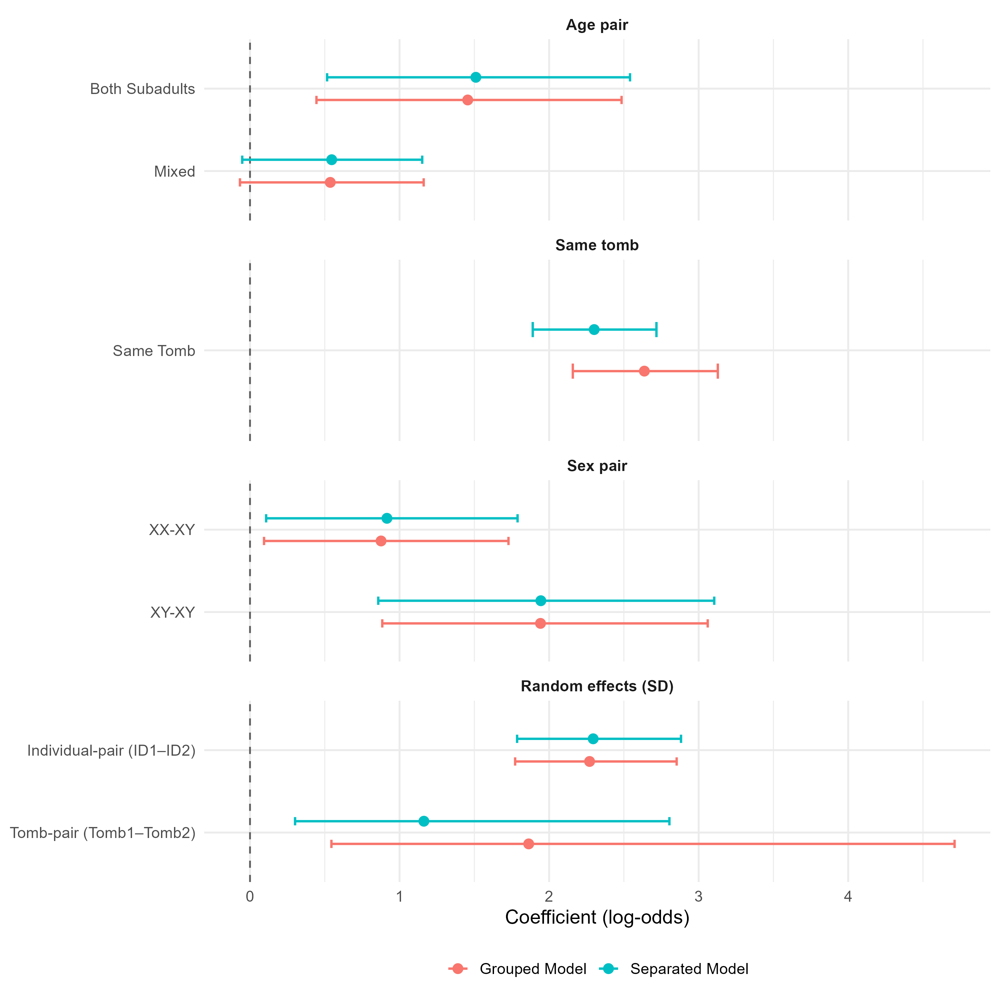
```


A primary observation is the dominance of Same Tomb Indicator, which yielded the highest estimate in both models (2.30 and 2.64, respectively). This signifies that shared burial space is the strongest predictor of biological kinship in this dataset. Regarding biological predictors, the Male-Male (XY-XY) combination stands out with a consistent estimate of 1.94, much higher than the Female-Male (XX-XY) estimate of $\approx 0.90$. Furthermore, the Both Subadult category (1.51 and 1.46) suggests a strong horizontal kinship signal among children.

The multilevel hyperparameters reveal substantial variation at the individual level ($sd \approx 2.29$), which suggests that the density of kinship ties is not uniform across the population, but rather concentrated around specific individuals. At the tomb level, the estimated standard deviation increases from 1.16 in the Separated Model to 1.86 in the Grouped Model. This increase suggests that grouping the Elateia (Tomb 46, 56, and 62) tombs allows the model to better account for differences between burial sites. Crucially, the fixed effects remained consistent across both models, proving that the results are not dependent on how the tombs were categorized.

## Model Interpretation 

The model output is reported in log-odds, as is standard in logistic regression. However, coefficients expressed on the log-odds scale are not directly intuitive to interpret. To make the results more accessible, we therefore calculate marginal predicted probabilities. These convert the model estimates into probabilities of the outcome, which in this case, the probability that a pair of individuals is biologically related.

Marginal predicted probabilities indicate how each explanatory variable affects the average probability of relatedness, while holding all other variables constant (ceteris paribus). This approach allows for a more accessible interpretation of the model results by expressing effects in terms of probabilities rather than log-odds.

```{r fig12, echo=FALSE, fig.cap="Predicted probabilities of biological relatedness with 95% credible intervals", fig.pos='H', out.width="100%"}
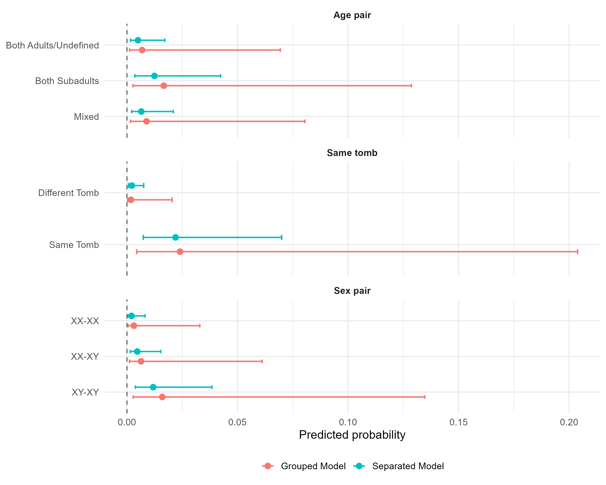
```

The average predicted probabilities in the figure highlight several key patterns across sex pairings, age compositions, and burial contexts. Female–Female (XX-XX) pairs show relatively low average predicted probabilities of relatedness (0.21% in the separate tombs model and 0.31% in the grouped tombs model, ceteris paribus), while Male-Male (XY-XY) pairs exhibit higher probabilities compared to other sex combinations. 
For age composition, pairs of two subadults show predicted probabilities of relatedness of 1.24% in the separated tombs model and 1.66% in the grouped-tombs model. Lower probabilities are observed for mixed adult–subadult pairs (0.65% and 0.89%), followed by pairs of two adults or undefined individuals (0.50% and 0.69%).
The largest difference is observed for burial context: pairs buried in the same tomb have predicted probabilities of 2.20% and 2.40%, compared to 0.22% and 0.19% for pairs from different tombs.


## Model Robustness Check
To ensure that the results obtained in the primary MM-GLMM are not artifacts of specific data distributions, prior specifications, or classification choices, we performed three sensitivity analyses. These tests evaluate whether our findings, particularly the dominant role of the tomb effect and sex-specific patterns, remain consistent under alternative model conditions. All of the following comparison plots are from the separate model. The grouped model behaves quite similarly (see [Appendix](#appendix)).

### Sensitivity to Prior Specification
In the primary model, we utilized flat (uninformative) priors, which allow the data to drive the estimates entirely. To ensure the model was not "noise chasing", which means fitting patterns that do not truly exist, we re-fitted the model using Weakly Informative Priors $N(0,1)$. This approach applies a form of regularization, pulling estimates toward zero unless the data provides strong evidence to the contrary.

```{r a2, echo=FALSE, fig.cap="Estimations of model with flat prior and with weakly informative prior", fig.pos='H', out.width="100%"}
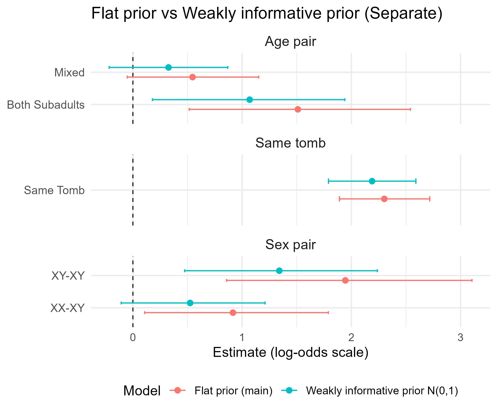
```


As expected with Priors $N(0,1)$, the coefficients experienced a slight shrinkage toward zero. No coefficients changed direction, and the variable Same Tomb Indicator remained the dominant predictor, largely unaffected by the prior. This confirms that the observed effects are driven by strong signals in the data rather than being an artifact of the prior choice. 

### Sensitivity to the "Same Tomb" Predictor (Within-Tomb Analysis)
Because the Same Tomb Indicator emerged as an exceptionally dominant predictor in our primary model, it was necessary to conduct a robustness check to ensure that other biological and demographic variables were not merely statistical artifacts of this effect.

To isolate the influence of sex and age from the overwhelming signal of shared burial space, we fitted a secondary model restricted exclusively to within-tomb pairs. This approach effectively removes the across-tomb variance, providing a focused look at the internal organization of the burial units. The model was restricted to the 2,990 observations involving individuals interred in the same tomb, compared to the 13,690 observations in the full dataset. Consequently, the estimated effects appear weaker, with coefficients shrinking toward zero.

```{r a3, echo=FALSE, fig.cap="Estimations of main model and 'with-in tomb' model", fig.pos='H', out.width="100%"}
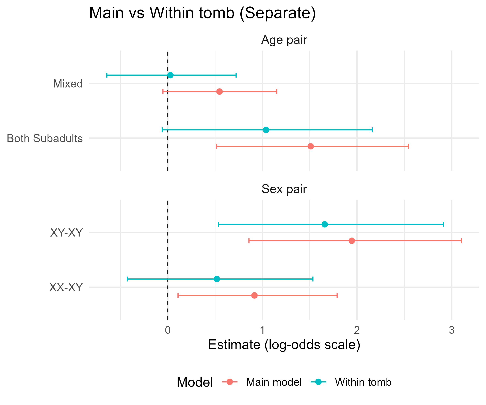
```

Despite the reduced power, the qualitative results remained consistent. The direction of all effects was unchanged, and the Male-Male (XY-XY) pair combination remained the dominant predictor of relatedness within the tomb. This confirms that the sex-biased patterns identified in the primary analysis are a fundamental characteristic of the kinship structure within these tombs and are not driven by the broader "Same Tomb" effect.

### Redefining the Relatedness Threshold (3rd Degree as Unrelated)
In our primary analysis, we collapsed 1st, 2nd, and 3rd-degree relatives into a single "Related" category. However, 3rd-degree relationships represent more distant biological ties. We conducted a robustness check by redefining the response variable $Y_{ij}$ to count only 1st and 2nd-degree relatives as "Related."

```{r a4, echo=FALSE, fig.cap="Estimations of main model and '3rd Degree as Unrelated' model", fig.pos='H', out.width="100%"}
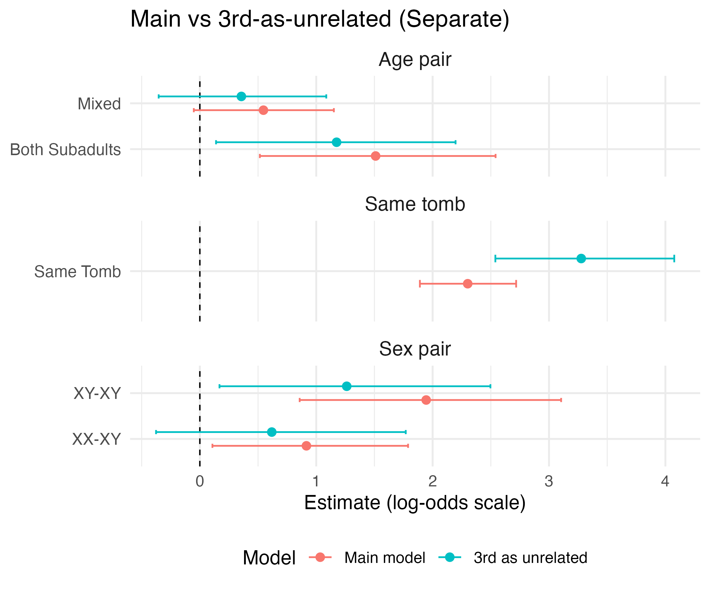
```

Under this stricter definition, the "Same Tomb" effect showed a substantially larger estimated coefficient. Notably, in the grouped model, the estimate increased straight from 2.63 to 12.17 (see plot in [Appendix](#appendix)). This suggests that shared burial context is an even stronger predictor for immediate kinship than for distant relatives. From an archaeological perspective, 3rd-degree kin may not have resided in the same immediate household or been interred in the family crypt as strictly as parent-child pairs. By including 3rd-degree relatives in the primary "Related" category, we effectively "diluted" the interment effect.

# Discussion 
## Model assumption
While the MM-GLMM provides a robust framework for analyzing pairwise kinship, the validity of its inferences depends on the underlying statistical assumptions. This section discusses the theoretical and empirical justifications for our model choices, as well as the potential impacts of deviations from these assumptions.

### Equal Weighting of Random Effects (w = 0.5)
In the multi-membership structure, we assumed equal weights ($w_i = w_j = 0.5$ and $w_{T(i)} = w_{T(j)} = 0.5$) for the random effects of individuals and tombs, respectively. This assumption is theoretically plausible at the individual level, as there is no a priori reason to believe one individual in a pair contributes more to the shared probability of relatedness than the other. Furthermore, simulation studies by @smith2014impact suggest that multi-membership models are generally robust to weight misspecification, meaning that even if the "true" weights were slightly unequal, the resulting fixed-effect estimates remain reliable.

### Normality of Random Effects
A standard assumption of GLMMs is that the random effects ($u$ and $v$) are independently and identically distributed following a normal distribution: $u,v \sim \mathcal{N}(0, \sigma^2)$. We evaluated this through Q-Q plots for both the Individual and Tomb random effects in the separate model version. The grouped model behaves similarly (see [Appendix](#appendix)).

```{r a qq, echo=FALSE, fig.cap="Q-Q Plots for Random Effects (separate)", fig.pos='H', out.width="90%"}

```

For individual random effect diagnostic plots, the distribution is somewhat skewed. Non-normality in random effects can potentially lead to a biased global intercept and an inaccurate estimation of the random effect distribution's shape. However, literature on mixed models @mcculloch2011misspecifying demonstrates that fixed-effect estimates and variance components are stable even when the normality assumption for random effects is violated.

The diagnostic for the tomb-level effects is limited by the low number of levels. According to @maas2005sufficient, the estimation of the random effect variance ($\sigma^2_{tomb}$ can be biased or imprecise when the number of clusters is small (typically $<30$). However the fixed-effect regression coefficients remain unbiased. The model therefore remains a valid tool to interpret the influence of the fixed-effect variables.


## Selection Bias
A threshold of 15,000 overlapping SNPs was applied across all kinship degrees to address the issue of missing not at random (MNAR) data. By restricting the analysis to observations that meet this quality criterion, the focus is placed exclusively on a high-quality subset of the available genetic data. Although this procedure increases the reliability of kinship estimates, it may introduce selection bias, as individuals with lower data quality are systematically excluded from the analysis. As a result, the findings may not be fully generalizable to the broader population under study.

## Outlook for Future Studies
Future research should aim to expand the empirical basis of the analysis by incorporating a substantially larger number of tombs across multiple archaeological contexts. A broader sample would allow for the estimation of robust tomb-level or multilevel models with a sufficient number of higher-level units. This would enable a more reliable assessment of tomb-specific characteristics such as length of use, number of interred individuals, and skeletal preservation patterns and their influence on genetic relatedness structures. With increased statistical power, contextual variation between burial units could be modeled more systematically.

In addition, future research should further address the issue of missing data. In the present study, applying a single SNP threshold helped reduce bias in the classification of kinship degrees. However, this decision also meant that only individuals with sufficiently high genetic data quality were included in the analysis. As a result, part of the available information had to be excluded. Future studies could benefit from improved sequencing quality and broader genomic coverage, which would reduce the need for strict thresholds and allow more individuals to be retained in the analysis. Moreover, applying alternative statistical approaches to evaluate how different missing data assumptions affect the results could help assess the stability and robustness of the findings.

From a methodological perspective, future research could explore extensions of the multi-membership generalized linear mixed model. Relaxing assumptions such as equal random-effect weights or normally distributed random effects may allow for a more flexible representation of individual- and tomb-level heterogeneity. Furthermore, larger datasets would permit more stable estimation of variance components, particularly at the tomb level, thereby improving inference regarding contextual effects.

Finally, future work should evaluate the potential impact of selection processes introduced by quality thresholds. Comparing results obtained from high-quality subsamples with those from broader inclusion criteria or alternative imputation strategies may help assess the generalizability of the findings to the wider population under study.

# Literature Review
Recent developments in archaeogenetics have made it possible to directly investigate biological relatedness in past populations using ancient DNA. Advances in sequencing techniques and computational methods allow researchers to infer kinship relationships from genome-wide data, providing new insights into the social organization of ancient communities. Methods such as READv2 estimate relatedness from patterns of allele mismatches across overlapping single nucleotide polymorphisms (SNPs) and classify pairs into degrees of biological relatedness based on statistical thresholds [@alaccamli2024readv2]. However, the reliability of such classifications depends strongly on data quality, particularly the number of overlapping SNPs available for comparison. Low genomic coverage increases uncertainty and may lead to misclassification of relationships, making careful filtering and statistical modeling essential in archaeogenetic studies.

Several studies emphasize that genetic kinship reconstructed from DNA does not necessarily correspond directly to social kinship structures observed in archaeological contexts. Genetic relatedness represents biological relationships, while social kinship may reflect broader cultural practices such as household organization, inheritance systems, or burial traditions [@pohl2023can]. Consequently, interpreting genetic relationships requires integrating genetic evidence with archaeological and anthropological data.

In the context of Bronze Age and Mycenaean societies, burial practices have been widely studied to understand social organization and group structure. Mycenaean collective tombs often contain multiple individuals deposited over long periods of time, sometimes involving secondary burial practices and reorganization of earlier remains. These practices complicate the interpretation of biological relationships within tombs, as individuals buried together may represent extended kin groups, broader community networks, or socially defined burial groups rather than nuclear families [@moutafi2015towards]; [@Moutafi2016]. Bioarchaeological studies suggest that patterns of burial, including age and sex distributions, may reflect social hierarchies, lineage structures, or residence patterns.

Archaeogenetic studies have also identified recurring patterns of relatedness in prehistoric burial contexts. In several cases, kinship networks appear structured around male individuals, while female individuals are more often connected through marriage links across burial groups. Such patterns are consistent with interpretations of patrilocal residence systems, in which males remain within their natal community while females move between groups through marriage alliances [@moutafi2015towards]; [@Boyd2016]. Although interpretations vary across sites and periods, these findings highlight the importance of integrating demographic characteristics such as sex and age into the analysis of genetic relatedness.

From a methodological perspective, analyzing kinship patterns in archaeological datasets presents several statistical challenges. Observations are often structured as pairwise comparisons between individuals, meaning that each individual appears in multiple observations. This creates dependencies that violate the independence assumptions of standard regression models. Multi-membership multilevel models provide a suitable framework for handling such structures because they allow each observation to belong to multiple higher-level units simultaneously, such as individuals and tombs [@browne2001multiple]. Bayesian approaches are particularly useful for estimating such models because they allow flexible specification of complex hierarchical structures and provide robust inference even with relatively small sample sizes [@burkner2017advanced]; [@maas2005sufficient].

In addition to hierarchical dependencies, missing data and measurement uncertainty represent important challenges in ancient DNA research. Because kinship classification depends on the availability of sufficient SNP overlap, missing data may occur in a non-random way, potentially biasing statistical inference. Previous methodological research therefore emphasizes the importance of accounting for data quality and measurement processes when interpreting observed kinship patterns [@Seguin2021]; [@Vai2020]. Conceptual frameworks that distinguish between underlying biological relationships and measurement processes are therefore useful for clarifying how observed genetic relationships arise from both biological and technical factors.

Overall, previous research demonstrates that genetic data can provide valuable insights into kinship structures in archaeological contexts, but also highlights several methodological and interpretative challenges. Biological relatedness reconstructed from ancient DNA must be interpreted carefully, as burial practices, social organization, and cultural traditions may not correspond directly to genetic family relationships. At the same time, the reliability of kinship inference depends strongly on data quality, sequencing coverage, and statistical modeling choices. These studies underline the importance of combining archaeogenetic data with appropriate statistical frameworks that account for measurement uncertainty, sampling bias, and the complex structure of pairwise kinship observations.

\appendix

# Appendix {#appendix}

```{r a robust appendix, echo=FALSE, fig.cap="Robust check result plots for grouped models", fig.pos='H', out.width="100%"}
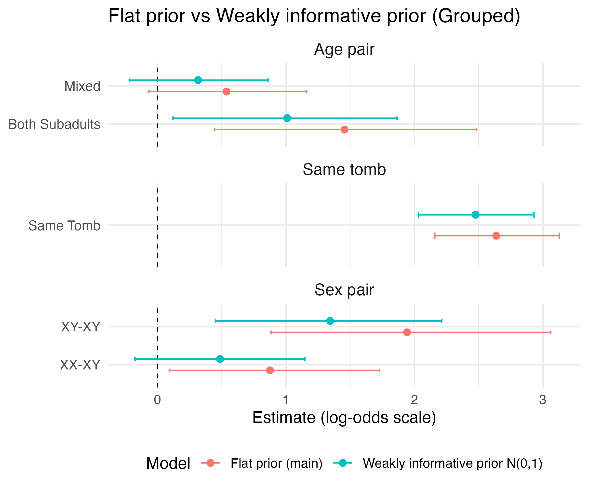
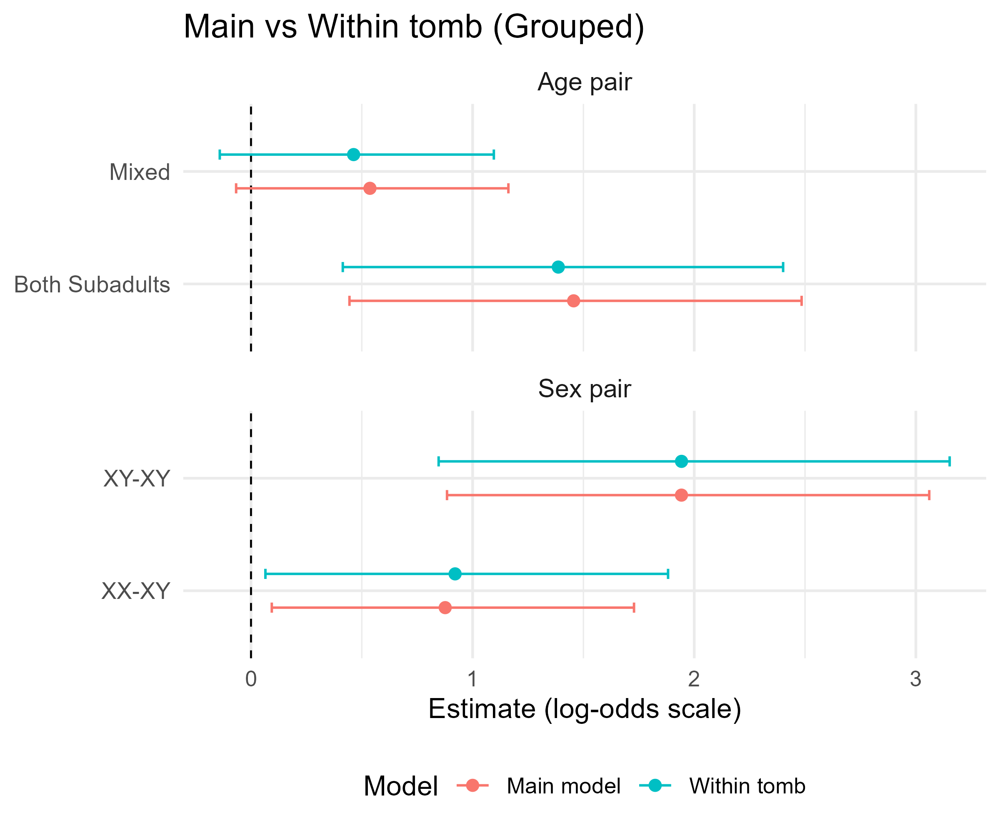
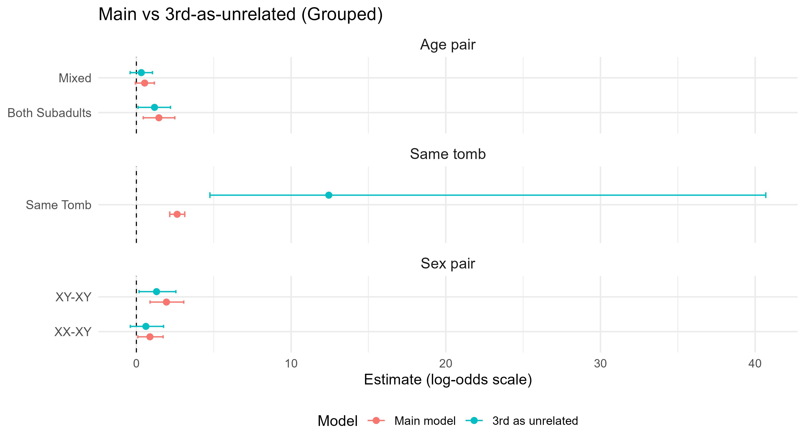
```

```{r ap qq, echo=FALSE, fig.cap="Q-Q Plots for Random Effects (grouped)", fig.pos='H', out.width="100%"}
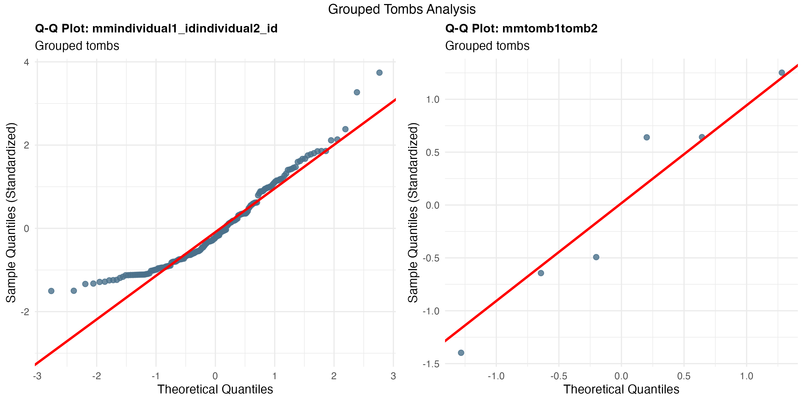
```

# Acknowledgment
We sincerely thank our project partners, Irene Högner and Alissa Mittnik, for their valuable collaboration and feedback, as well as our supervisor, Yichen Han, for his dedicated guidance and academic support throughout the research and analysis phases of this project.

# Use of AI tools

**Report**

ChatGPT (GPT-5.2) helped improve the grammar, language and make the writing clearer. It was also used to assist with LaTeX and RMarkdown formatting for equations and the general report layout. All research ideas, data interpretations, and conclusions are our own. We reviewed and verified every part of the final text.

**Code and Modeling**

ChatGPT (GPT-5.2) and Gemini helped fix and improve the R code used for the models and charts. While the AI suggested ways to handle errors, we made all final decisions on model settings and which variables to include. We tested all code manually to ensure it worked correctly.

**Literature Research**

ChatGPT (GPT-5.2) and Gemini was used to help find search keywords, recommend relevant sources and explain basic theories. Despite this, we found, read, and checked all cited sources ourselves using academic databases. No references were added without us verifying them first.


# References

