```{r setup, include=FALSE}
source("environment_setup.R")
source("Data/pairs_data.R")
source("Analysis/model_assumption.R")
source("Analysis/models_comparison.R")
```

## Outline

::::: columns
::: column
**1. Project Overview**

-   Overview

**2. Data Description**

-   Data Sets
-   Research Questions
-   Process

**3. Data Visualization**

-   Descriptive Plots
:::

::: column
**4. Model Fitting**

-   Limitation
-   Model Definition
-   Model Output & Interpretation
-   Model Robust Check

**5. Discussion**

-   Model Assumption
-   Selection Bias
:::
:::::

## Outline

**1. Project Overview**

-   Overview

[**2. Data Description**]{style="color:lightgray;"}\

[**3. Data Visualization**]{style="color:lightgray;"}\

[**4. Model Fitting**]{style="color:lightgray;"}\

[**5. Discussion**]{style="color:lightgray;"}\

## Project Overview

**Grave Analysis**: How do different factors influence the ratio of relatedness and unrelatedness in a collective tomb from Mycenaean times?

::: {style="text-align: center;"}

:::

## Project Overview

-   **Two burial sites**
    -   Amfissa (tholos)
    -   Elateia (chamber tombs): T31, T36, T46, T50, T56, T62, T67\
        **Note:** Analyze T46, T56, and T62 both as a group and as individual tombs

::::: columns
::: column
{width="70%"}
:::

::: column
{width="70%"}
:::
:::::

## Outline

[**1. Project Overview**]{style="color:lightgray;"}\

**2. Data Description**

-   Data Sets
-   Research Questions
-   Process

[**3. Data Visualization**]{style="color:lightgray;"}\

[**4. Model Fitting**]{style="color:lightgray;"}\

[**5. Discussion**]{style="color:lightgray;"}\

## Data Description

**1. Tomb parameters** - Summary information for each tomb:

-   **Minimum number of individuals (MNI)**\

-   **Number of analysed individuals**\

-   **Length of tomb use (years)**\

-   **Sample success rate (%)**

## Data Description

**2. Individual metadata** - Information of each sampled individual:

-   **Sex**

-   **Age estimation**

-   **Skeletal element**

-   **Tomb and site**

## Data Description

**3. Kinship results -** Pairwise relatedness results between individuals:

-   **Relationship category**: 1st / 2nd / 3rd degree

-   **Overlapping SNPs**: The total amount of shared genetic data available to compare two individuals

-   **P0 (Pairwise Mismatch Rate)**: proportion of SNPs that do **not** match between two individuals

## Research Questions

1.  [Develop and validate statistical models to predict the **difference between observed and potential relatedness**, using **tomb parameters** (length of use, estimated number of burials, sample success rate) as predictor variables, while accounting for potential confounding factors]{style="font-size:1.1em;"}

2.  [Build predictive models to estimate **relatedness** patterns using **individual-level covariates** (sex, age and skeletal element of sample), considering that some of these factors may be confounded with DNA preservation quality and sampling success]{style="font-size:1.1em;"}

## Kinship Estimation Framework (DAG)

{fig-align="center"}

## The READv2 Classification Process

READv2 (Relationship Estimation from Ancient DNA)

{fig-align="center"}

## READv2 Performance & Statistical Validation

#### False Positive Rates and Classification Power

{fig-align="center"}

::: {style="font-size: 0.75em; line-height: 1.2;"}
**Coverage**: How much of the genome we actually managed to recover from the ancient sample\
**Dashed Lines**:

-   **Red**: Original data quality thresholds

-   **Green**: 15K threshold
:::

## Empirical Precision of P0 vs. Overlapping SNP

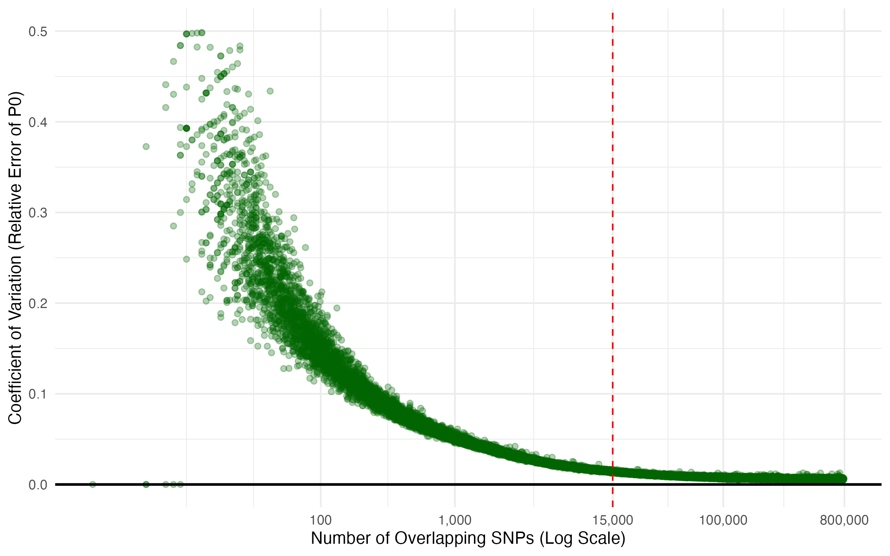{fig-align="center"}

::: {style="font-size: 0.75em; line-height: 1.2;"}
$$CV_{\hat{P_0}} = \frac{\text{nonnormalised p0 serr}}{\text{nonnormalised p0}}$$

**Coefficient of Variation**: the relative precision of our kinship estimate
:::

## Outline

[**1. Project Overview**]{style="color:lightgray;"}\

[**2. Data Description**]{style="color:lightgray;"}\

**3. Data Visualization**

-   Descriptive Plots

[**4. Model Fitting**]{style="color:lightgray;"}\

[**5. Discussion**]{style="color:lightgray;"}\

## Data Visualization

### [Number of within-tomb pairs by relationship]{style="font-size:26px;"}

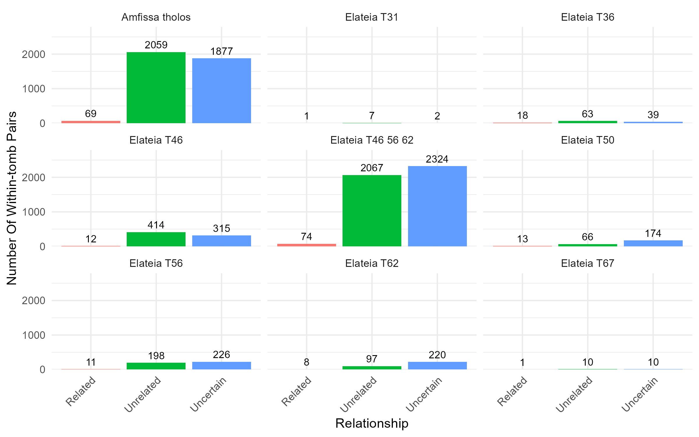{fig-align="center" width="70%"}

## Data Visualization

### [Proportion of within-tomb pairs by relationship]{style="font-size:26px;"}

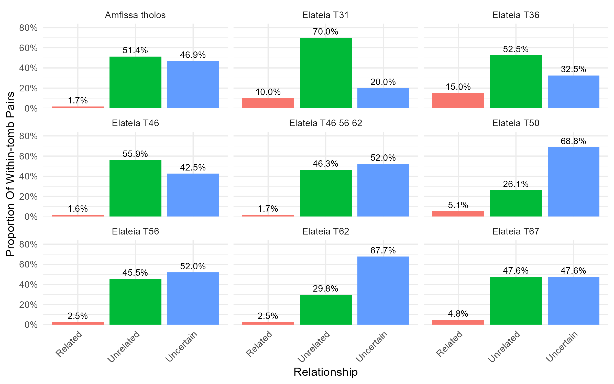{fig-align="center" width="70%"}

## Data Visualization

### [Kinship Networks]{style="font-size:26px;"}

::: {style="display:flex; gap:20px;"}
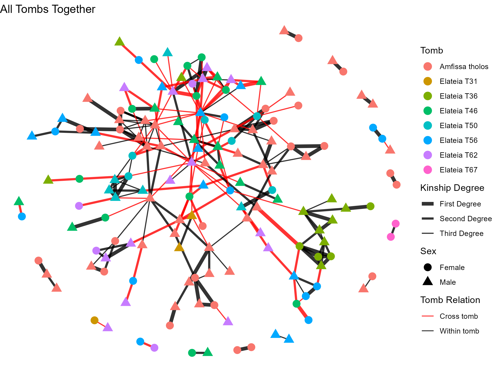 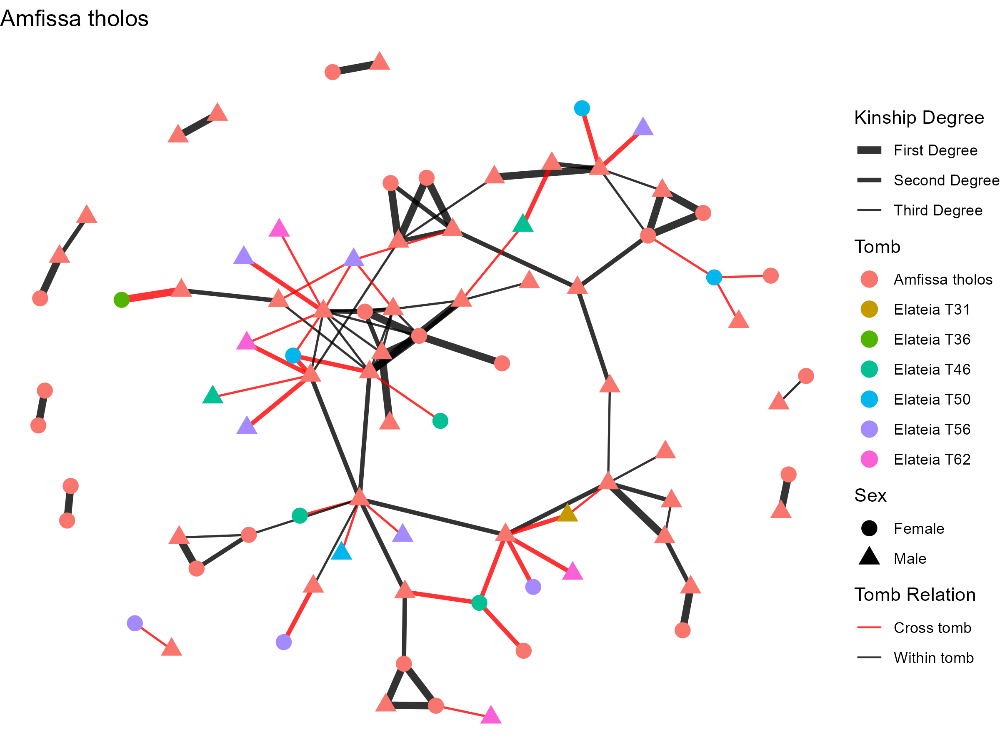
:::

## Data Visualization

### [Kinship Networks]{style="font-size:26px;"}

::: {style="display:flex; gap:20px;"}
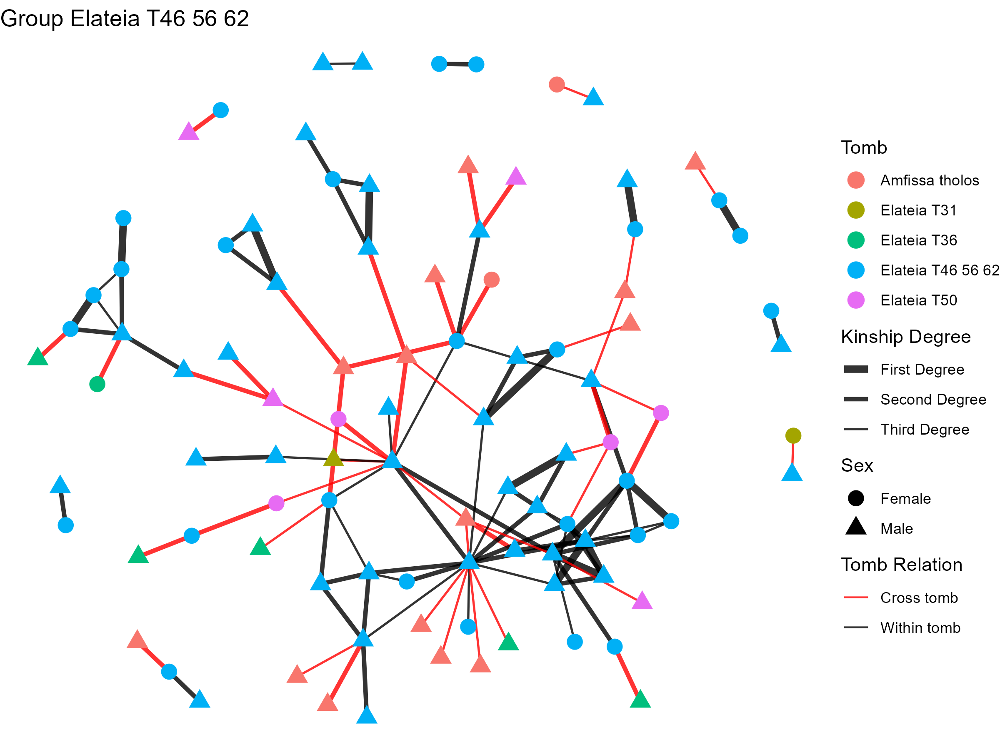 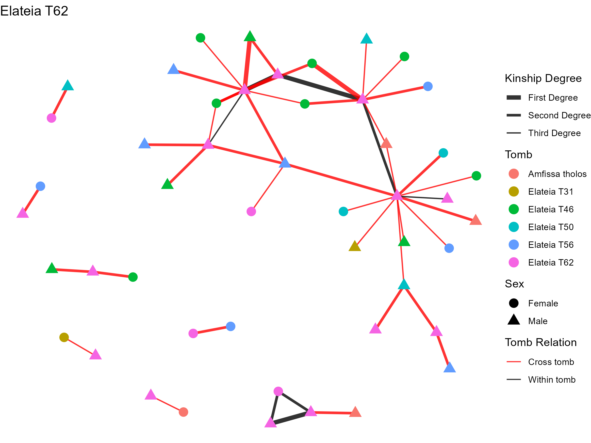
:::

## Data Visualization

### [Kinship Networks]{style="font-size:26px;"}

::: {style="display:flex; gap:20px;"}
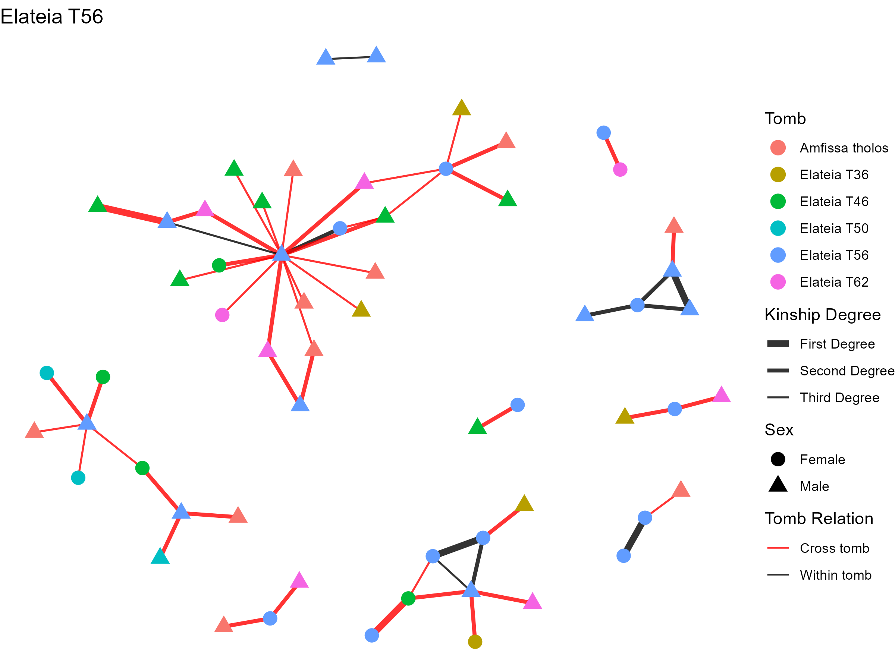 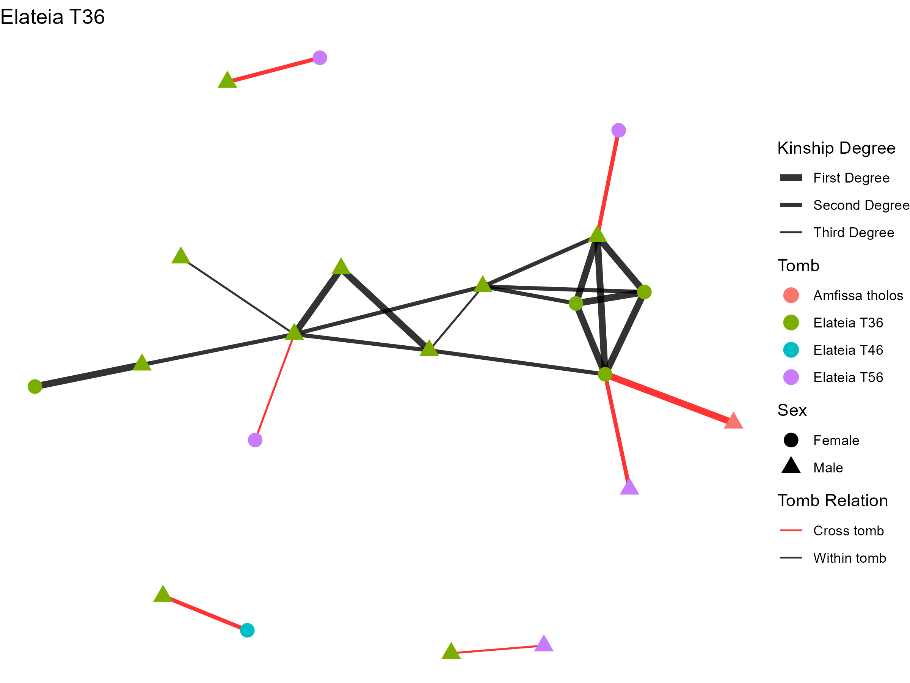
:::

## Data Visualization

### [Kinship Networks]{style="font-size:26px;"}

::: {style="display:flex; gap:20px;"}
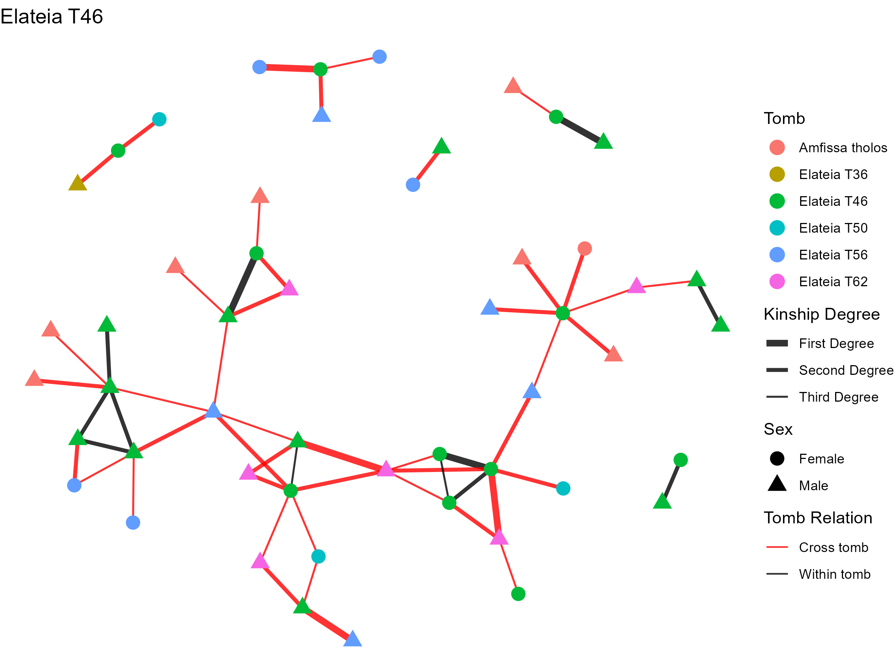 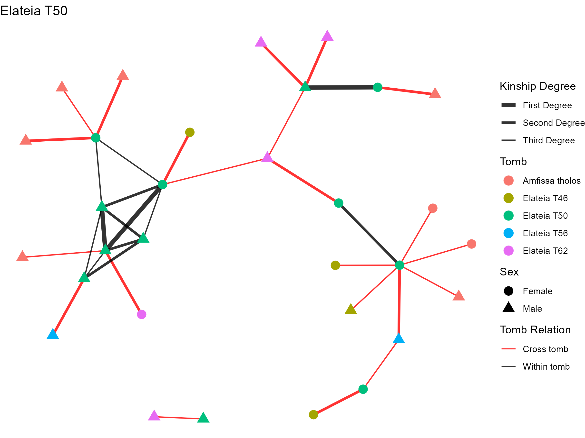
:::

## Data Visualization

### [Kinship Networks]{style="font-size:26px;"}

::: {style="display:flex; gap:20px;"}
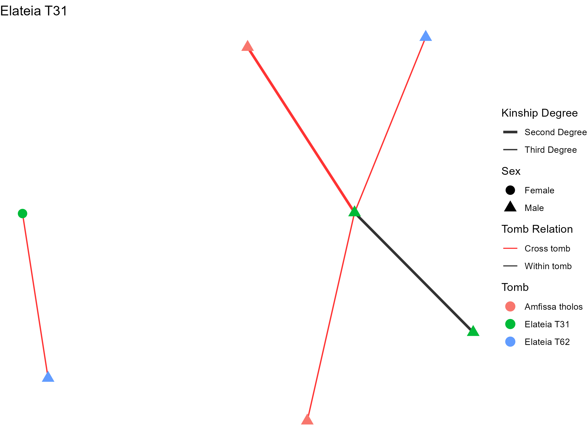 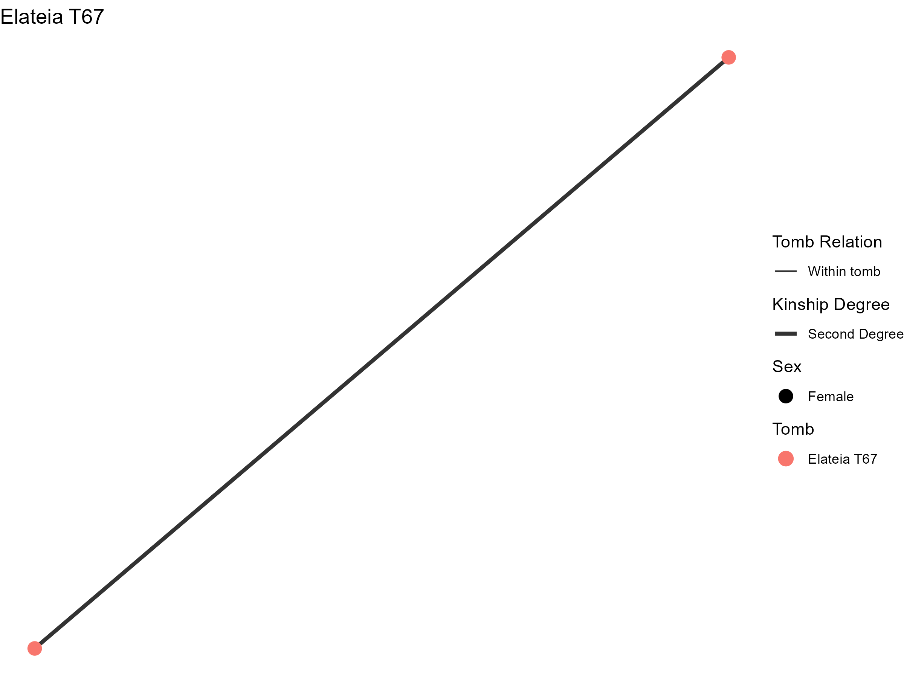
:::

## Outline

[**1. Project Overview**]{style="color:lightgray;"}\

[**2. Data Description**]{style="color:lightgray;"}\

[**3. Data Visualization**]{style="color:lightgray;"}\

**4. Model Fitting**

-   Limitation
-   Model Definition
-   Model Output & Interpretation
-   Model Robust Check

[**5. Discussion**]{style="color:lightgray;"}\

## Model Fitting

### Limitation

#### 1. Tomb-level model not possible

-   **Small number of tombs**: Amfissa and 7 tombs from Elateia
-   For too many parameters: length of use, analysed individuals, effect of 4 types of skeletal elements

$\Rightarrow$ **With the available data, a meaningful tomb-level model is not possible**

## Model Fitting

### Limitation

#### 2. Missing Not At Random (MNAR)

{fig-align="center"}

## Model Fitting

### Limitation

#### 2. Missing Not At Random (MNAR)

{fig-align="center"}

$X_O$ : Observed variables $\rightarrow$ Tomb, Age, Sex, Overlapping SNPs,...

$X_M$ : Variables that are missing for some observations $\rightarrow$ Kinship status

$R$ : Missingness indicator

## Model Fitting

### Limitation - Missing Not At Random (MNAR)

$$
R =
\begin{cases}
1, & \text{if kinship is classified (1st/2nd/3rd)}, \\
0, & \text{if kinship status is classified as "Uncertain".}
\end{cases}
$$

Threshold:

-   1st degree $\rightarrow$ needs $\ge 500 \text{ SNPs}$
-   2nd degree $\rightarrow$ needs $\ge 2000 \text{ SNPs}$
-   3rd degree $\rightarrow$ needs $\ge 15000 \text{ SNPs}$

$$
\Rightarrow R = \mathbb{I}\!\left( \mathrm{OSNP} \ge \text{threshold depending on Kinship status} \right)
$$

$$\Rightarrow P(R | X_O, X_M) \text{ depends on } X_M = \text{Kinship status}$$ $\Rightarrow$ **Missing Not At Random (MNAR)**

## Model Fitting

### Limitation - Missing Not At Random (MNAR)

**Solution:** Apply only one threshold 15000 for all degrees of kinship

$$
R =
\begin{cases}
1, & \mathrm{OSNP} \ge 15000, \\
0, & \text{otherwise}
\end{cases}
$$

$$
R = \mathbb{I}\!\left( \mathrm{OSNP} \ge 15000 \right),
$$

$$\Rightarrow P(R | X_O, X_M) \text{ depends on } X_O = \text{Overlapping SNPs}$$

$\Rightarrow$ **Missing At Random (MAR)**

## Model Fitting

### Model Definition

{fig-align="center" width="90%"}

-   Observation: 1 pair (belongs to 2 tombs + 2 individuals)
-   Each individual appears in many pairs
-   Both within- and across-tomb pairs are observed

$\Rightarrow$ **Multi-Membership Generalized Linear Mixed Model (MM-GLMM)**

## Model Fitting

### Model Definition

Let $Y_{ij} = 1$ if individuals $i$ and $j$ are related, and $Y_{t,ij} = 0$ otherwise.

We assume:

$$
Y_{t,ij} \sim \text{Bernoulli}(\pi_{ij})
$$

where $\pi_{ij} = P(\text{related}_{ij} = 1)$.

**Multi-Membership Generalized Linear Mixed Model (MM-GLMM)**

$$
\text{logit}(\pi_{ij}) = \alpha + \mathbf{X}_{ij}^{\top}\boldsymbol{\beta} 
    + \underbrace{(w_i u_i + w_j u_j)}_{\text{Individual RE}} 
    + \underbrace{(w_{T(i)} v_{T(i)} + w_{T(j)} v_{T(j)})}_{\text{Tomb RE}}
$$

## Model Fitting

### Model Definition

$$
\text{logit}(\pi_{ij}) = \alpha + \mathbf{X}_{ij}^{\top}\boldsymbol{\beta} 
    + \underbrace{(w_i u_i + w_j u_j)}_{\text{Individual RE}} 
    + \underbrace{(w_{T(i)} v_{T(i)} + w_{T(j)} v_{T(j)})}_{\text{Tomb RE}}
$$

Where:

-   $\alpha$: Global intercept
-   $\mathbf{X}_{ij}$: Covariate vector
-   $u_i$: RE for Individual with $u \sim \mathcal{N}(0, \sigma^2_{\text{ind}})$
-   $v_t$: RE for Tomb with $v \sim \mathcal{N}(0, \sigma^2_{\text{tomb}})$
-   $w$: Weight $w_i$ = $w_j$ = $w_{T(i)}$ = $w_{T(j)}$ = 0.5

## Model Fitting

{fig-align="center"}

## Model Fitting

### Variables

```{r variables, echo=FALSE}
pairs_ind_show <- pairs_ind |>
  select(related_binary, sex_pair, age_pair, same_tomb, individual1_id, individual2_id, tomb1, tomb2)

set.seed(987)
pairs_ind_show |>
  slice_sample(n = 20) |>
  slice(11:20) |>
  gt() |>
  tab_header(
    title = "Variables in the model"
  )
```

-   Use r library "brms" (Bayesian Regression Models using 'Stan')
-   One version for all separated tombs
-   One version with Tomb 46, 56, 62 grouped as 1 tomb

## Model Fitting

### Model Output

#### Separated Version

```{r mod sep, echo=FALSE, out.height="500px"}
imp_binary_separate_nobone <- readRDS("Analysis/Saved models/imp_binary_separate_nobone.rds")
imp_binary_separate_nobone
```

## Model Fitting

### Model Output

#### Grouped Version

```{r mod group, echo=FALSE, out.height="500px"}
imp_binary_group_nobone <- readRDS("Analysis/Saved models/imp_binary_group_nobone.rds")
imp_binary_group_nobone
```

## Model Fitting

### Sampling health (Diagnostic)

1.  R-hat = 1.00: Excellent, all chains have converged to the same distribution.
2.  Effective Sample Size: Pretty large number of independent samples (\>3000).

## Model Fitting

### Model Estimates

{fig-align="center" width="75%"}

## Model Fitting

### Marginal Effect (Predicted Probabilities)

-   Logistic regression coefficients are on the **log-odds** scale (hard to interpret)
-   **Marginal predicted probabilities** convert model results into **probabilities** of the outcome (*being related*)
-   *“The marginal predicted probabilities tells us how the variable effects the average probability that a pair is related, holding other variables constant.”*

## Model Fitting

### Model Interpretation

{fig-align="center" width="90%"}

## Model Fitting

### Model Robust Check

#### Within-tomb pairs only

-   **Context:** *same_tomb* is a very dominant predictor
-   Robust check to see if the other variables are just artifacts of this
-   Fit model to only within-tomb pairs

## Model Fitting

### Model Robust Check

#### Within-tomb pairs only

::::: columns
::: {.column width="60%"}
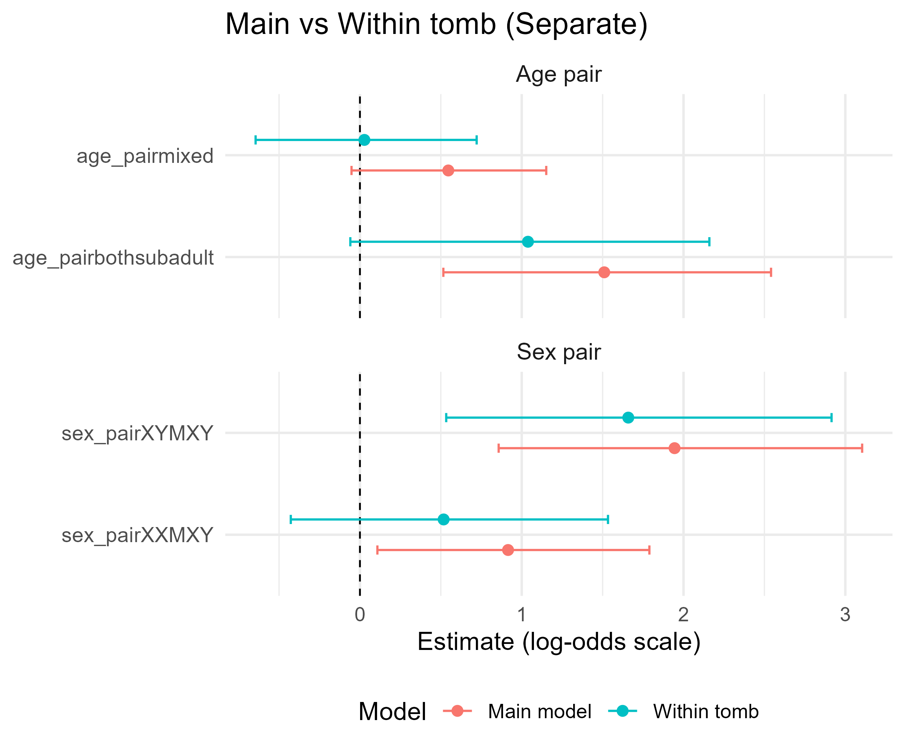{width="100%"}
:::

::: {.column width="40%"}
-   Effects are weaker
-   Direction unchanged
-   Male×Male still dominant
:::
:::::

## Model Fitting

### Model Robust Check

#### 3rd degree as unrelated

-   Fit model with new definition of relatedness:
    -   1st/2nd degree: related
    -   3rd degree: unrelated

## Model Fitting

### Model Robust Check

#### 3rd degree as unrelated

::::: columns
::: {.column width="60%"}
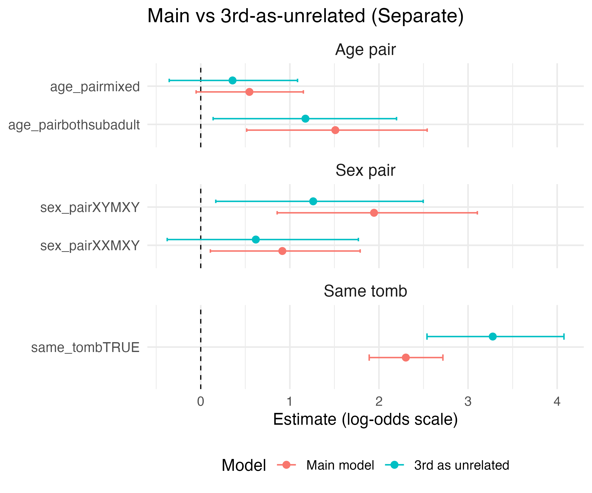
:::

::: {.column width="40%"}
-   *same_tomb* shows a substantially larger estimated effect.
-   Shared burial context is a strong predictor of immediate kinship.
:::
:::::

## Outline

[**1. Project Overview**]{style="color:lightgray;"}

[**2. Data Description**]{style="color:lightgray;"}

[**3. Data Visualization**]{style="color:lightgray;"}

[**4. Model Fitting**]{style="color:lightgray;"}

**5. Discussion**

-   Model Assumption
-   Selection Bias

## Discussion

### Model Assumption

1.  Equal RE weight assumption ($w = 0.5$)

$$
\text{logit}(\pi_{ij}) = \alpha + \mathbf{X}_{ij}^{\top}\boldsymbol{\beta} 
    + \underbrace{(w_i u_i + w_j u_j)}_{\text{Individual RE}} 
    + \underbrace{(w_{T(i)} v_{T(i)} + w_{T(j)} v_{T(j)})}_{\text{Tomb RE}}
$$

-   Theoretically plausible (individual level)
-   MM models robust to weight misspecification (Wolff Smith & Beretvas (2014))

## Discussion

### Model Assumption

2.  Assumption of RE normality $u, v \sim \mathcal{N}(0, \sigma^2)$

```{r assumption sep}
plot_qq_both_effects(imp_binary_separate_nobone, "Separated tombs")
```

## Discussion

### Model Assumption

2.  Assumption of RE normality $u, v \sim \mathcal{N}(0, \sigma^2)$

```{r assumption group}
plot_qq_both_effects(imp_binary_group_nobone, "Grouped tombs")
```

## Discussion

### Model Assumption

2.  Assumption of RE normality $u, v \sim \mathcal{N}(0, \sigma^2)$

::::: columns
::: {.column width="50%"}
**Individual RE:**

-   Right skewed
-   **Risk:** Biased intercept and incorrect shape of the estimated RE distribution
-   **Mitigation:** Stable fixed effects and variance (McCulloch & Neuhaus (2011))
:::

::: {.column width="50%"}
**Tomb RE:**

-   Too few tombs
-   **Risk:** Biased RE variance
-   **Mitigation:** Unbiased fixed effects (Maas & Hox (2005))
:::
:::::

## Discussion

### Possible Selection Bias

-   15k threshold for all kinship degrees to treat MNAR
-   Only analyse high-quality data subset

$\Rightarrow$ Possible selection bias

$\Rightarrow$ Cannot infer to the larger population

## Bibliography

-   [Alaçamlı, Erkin, Thijessen Naidoo, Merve N. Güler, Ekin Sağlıcan, Şevval Aktürk, Igor Mapelli, Kıvılcım Başak Vural, Mehmet Somel, Helena Malmström, and Torsten Günther.\
    *READv2: advanced and user-friendly detection of biological relatedness in archaeogenomics.*\
    Genome Biology 25, no. 1 (2024): 216]{style="font-size:0.80em;"}

-   [Boyd, Michael J.\
    *Becoming Mycenaean? The living, the dead, and the ancestors in the transformation of society in second millennium BC southern Greece.*\
    Death rituals, social order and the archaeology of immortality in the ancient world (2016): 200–220]{style="font-size:0.80em;"}

-   [Charles E. McCulloch & John M. Neuhaus.\
    *Misspecifying the Shape of a Random Effects Distribution: Why Getting It Wrong May Not Matter.*\
    Statistical Science 26, no. 3 (2011): 388–402]{style="font-size:0.80em;"}

-   [Crema, Enrico R.\
    *Statistical modelling in archaeology: some recent trends and future perspectives.*\
    Journal of Archaeological Science 180 (2025): 106295]{style="font-size:0.80em;"}

## Bibliography

-   [Maas, C. J. M., & Hox, J. J.\
    *Sufficient Sample Sizes for Multilevel Modeling.*\
    Methodology: European Journal of Research Methods for the Behavioral and Social Sciences 1, no. 3 (2005): 86–92]{style="font-size:0.80em;"}

-   [Millard, A. R.\
    *What can Bayesian statistics do for archaeological predictive modelling.*\
    In *Predictive modeling for archaeological heritage management: a research agenda*, Nederlandse Archeologische Rapporten 29 (2005): 169–182]{style="font-size:0.80em;"}

-   [Moutafi, Ioanna.\
    *Towards a social bioarchaeology of the Mycenaean period: A multi-disciplinary analysis of funerary remains from the Late Helladic chamber tomb cemetery of Voudeni, Achaea, Greece.*\
    PhD diss., University of Sheffield, 2015]{style="font-size:0.80em;"}

-   [Otárola-Castillo, Erik, & Melissa G. Torquato.\
    *Bayesian statistics in archaeology.*\
    Annual Review of Anthropology 47, no. 1 (2018): 435–453]{style="font-size:0.80em;"}

# Appendix

# [Absolute relation of MNI and analysed individuals]{style="font-size:26px;"}

{fig-align="center" width="70%"}

## Research findings

::: {style="font-size: 1.1em; line-height: 1.2;"}
-   Our result of significant male-to-male biological relatedness are consistent with recent archaeogenetic evidence from the Bronze Age, which identifies a social structure characterized by strict patrilocality and a unique system of intense first-cousin endogamy designed to maintain the integrity of family estates.

-   Studies explains that children and infants were part of the "household" unit. Finding them clustered together in the data is a sign that the tomb was capturing the nuclear and extended siblings of a single household, before those individuals grew up and potentially moved or changed status.

-   Studies highlights that "sample success" in Mycenaean tombs is heavily affected by secondary burial practices, which were the norm rather than the exception. In mixed contexts, certain skeletal elements are much more likely to be recovered than others. Skulls and long bones were often prioritized and kept, while smaller bones (hand/foot bones, vertebrae) were frequently lost or discarded during the cleaning and moving of earlier burials.
:::

## Model Comparison

### Standard threshold vs 15k threshold

```{r compare threshold}
compare_model(list(
  "15k threshold" = imp_binary_separate_nobone,
  "Standard threshold" = all_binary_separate_nobone
))


```

## Model Comparison

### Main model vs only same_tomb

```{r compare sametomb}
compare_model(list(
  "Main model" = imp_binary_separate_nobone,
  "Only same_tomb" = imp_binary_separate_sametomb
))
```

## Model Comparison

### Main model (flat prior) vs waek informative prior

```{r compare prior}
compare_model(list(
  "Flat prior" = imp_binary_separate_nobone,
  "Only same_tomb" = imp_binary_separate_nobone_prior
))
```

## Model Comparison

### Try out the “strict family in internal structure” model

```{r strict}
compare_model(list(
  "Within tomb" = imp_binary_separate_withintomb,
  "3rd as unrelated" = imp_binary_separate_unrel3rd,
  "Within tomb and 3rd as unrelated" = imp_binary_separate_withintomb_unrel3rd
))
```

## Model Robust Check

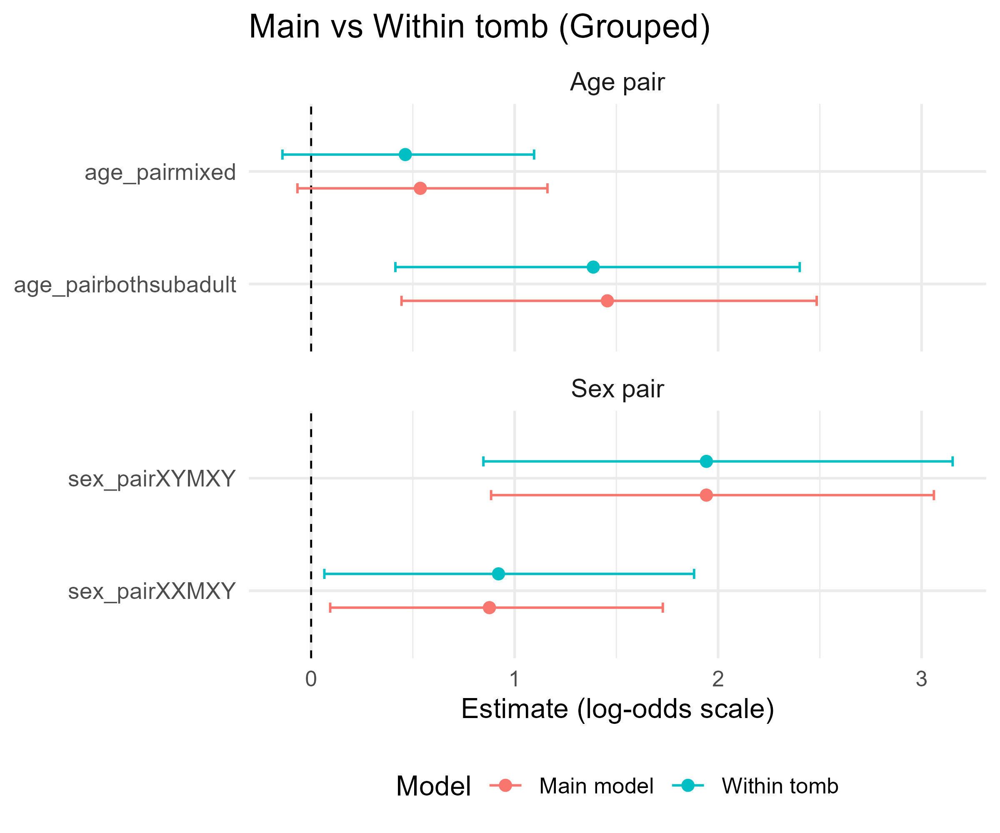{fig-align="center" width="70%"}

## Model Robust Check

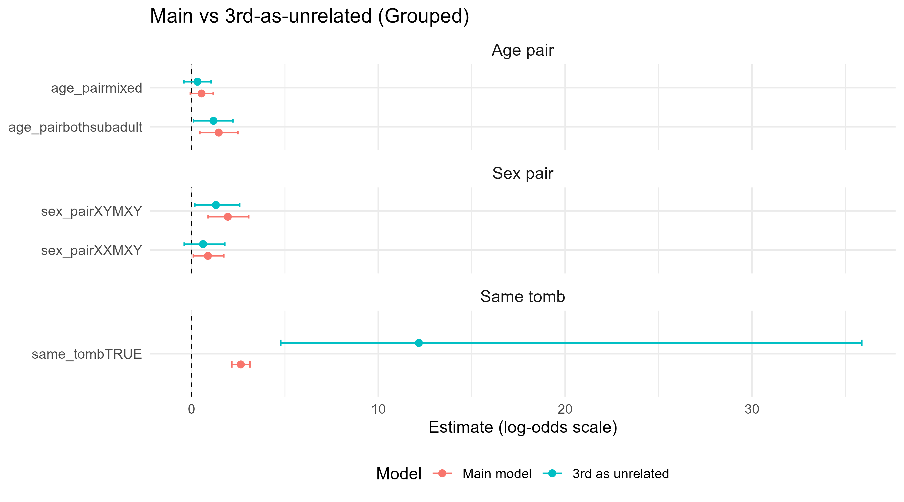{fig-align="center" width="70%"}
