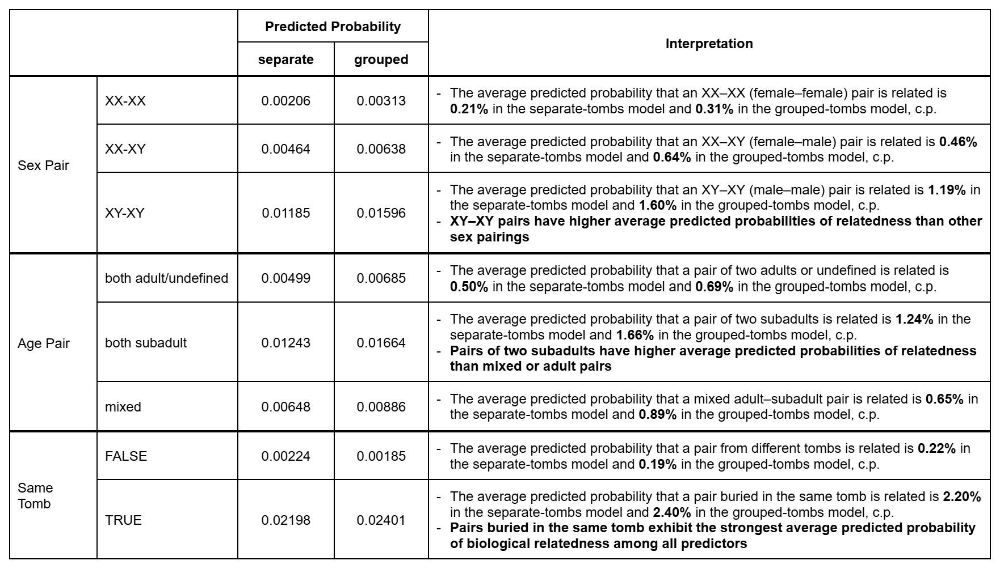
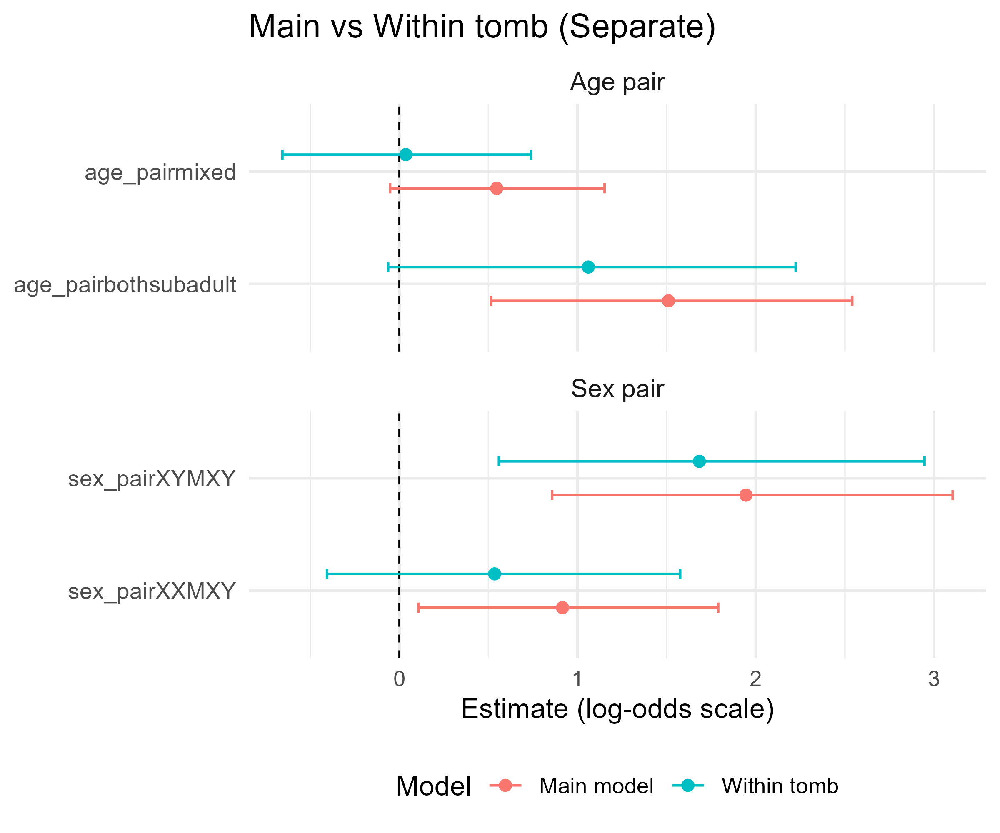
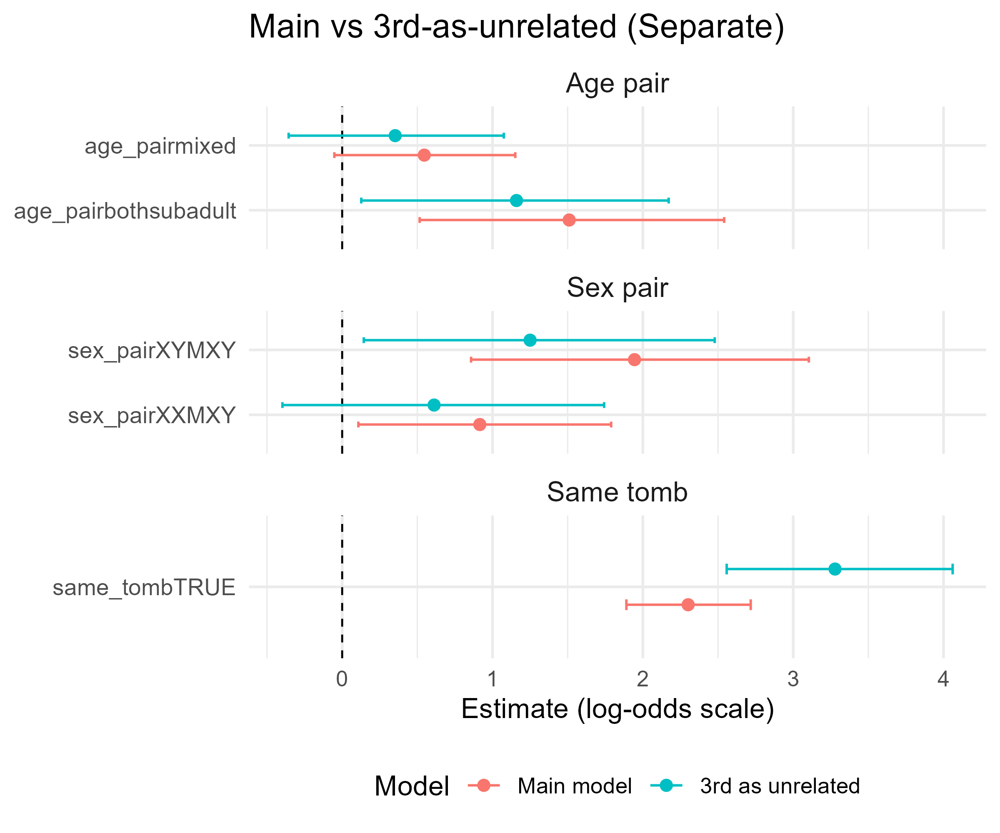

## Model Fitting

### Marginal Effect (Predicted Probabilities)

-   Logistic regression coefficients are on the **log-odds** scale (hard to interpret)
-   **Marginal predicted probabilities** convert model results into **probabilities** of the outcome (*being related*)
-   *“The average probability that a pair is related is obtained by averaging population-level predictions across all observations, holding other variables at their observed values.”*

## Model Fitting

### Model Interpretation

{fig-align="center" width="90%"}

## Model Fitting

### Model Robust Check

#### Within-tomb pairs only

-   **Context:** *same_tomb* is a very dominant predictor
-   Robust check to see if the other variables are just artifacts of this
-   Fit model to only within-tomb pairs

## Model Fitting

### Model Robust Check

#### Within-tomb pairs only

::::: columns
::: {.column width="60%"}
{width="100%"}
:::

::: {.column width="40%"}
-   All estimates shrink towards 0
-   Direction unchanged
-   Male×Male still dominant
:::
:::::

## Model Fitting

### Model Robust Check

#### 3rd degree as unrelated

-   Fit model with new definition of relatedness:
    -   1st/2nd degree: related
    -   3rd degree: unrelated

## Model Fitting

### Model Robust Check

#### 3rd degree as unrelated

::::: columns
::: {.column width="60%"}

:::

::: {.column width="40%"}
-   *same_tomb* shows a substantially larger estimated effect.
-   Shared burial context is a strong predictor of immediate kinship.
:::
:::::

## Discussion

### Model Assumption

1.  Equal RE weight assumption ($w = 0.5$)

$$
\text{logit}(\pi_{ij}) = \alpha + \mathbf{X}_{ij}^{\top}\boldsymbol{\beta} 
    + \underbrace{(w_i u_i + w_j u_j)}_{\text{Individual RE}} 
    + \underbrace{(w_{T(i)} v_{T(i)} + w_{T(j)} v_{T(j)})}_{\text{Tomb RE}}
$$

-   Theoretically plausible (individual level)
-   MM models robust to weight misspecification (Wolff Smith & Beretvas (2014))

## Discussion

### Possible Selection Bias

-   15k threshold for all kinship degrees to treat MNAR
-   Only analyse high-quality data subset

$\Rightarrow$ Possible selection bias
