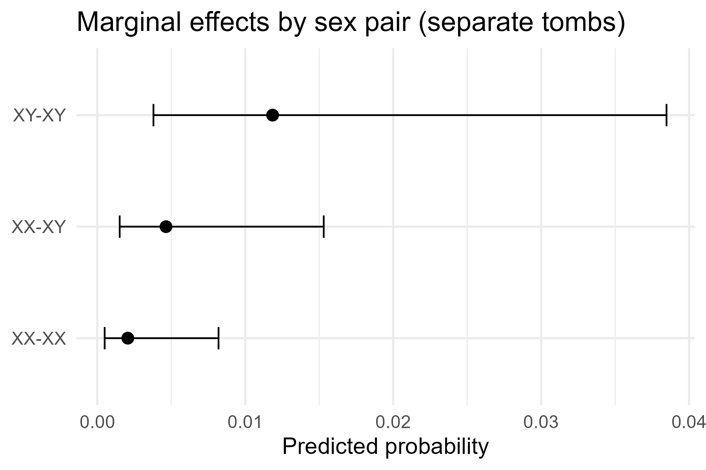
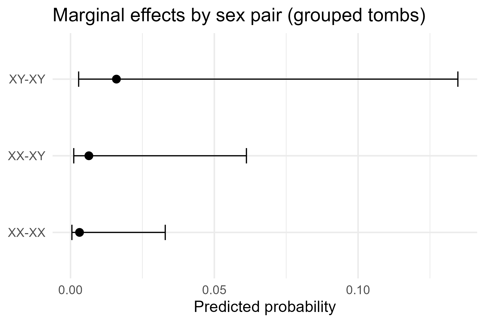
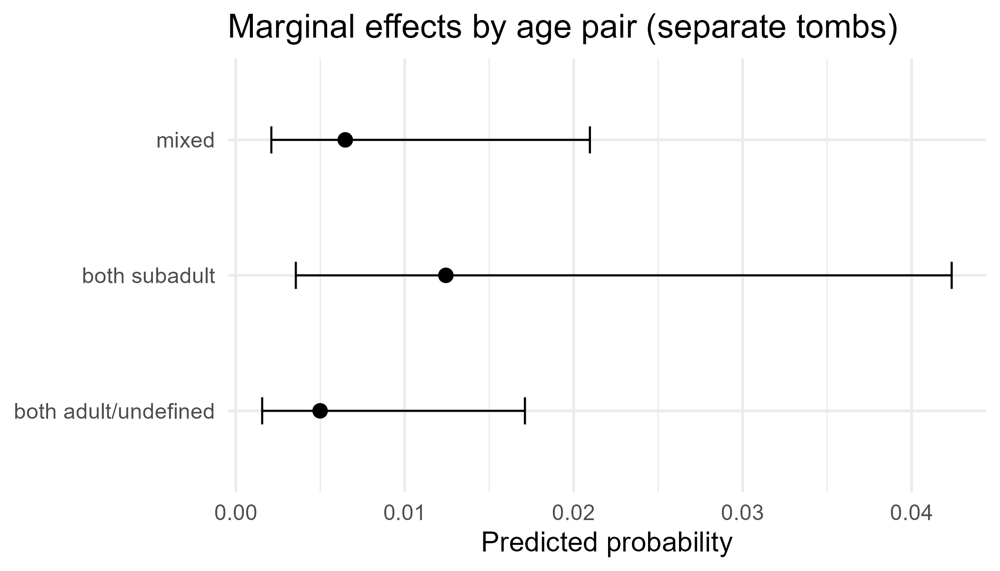
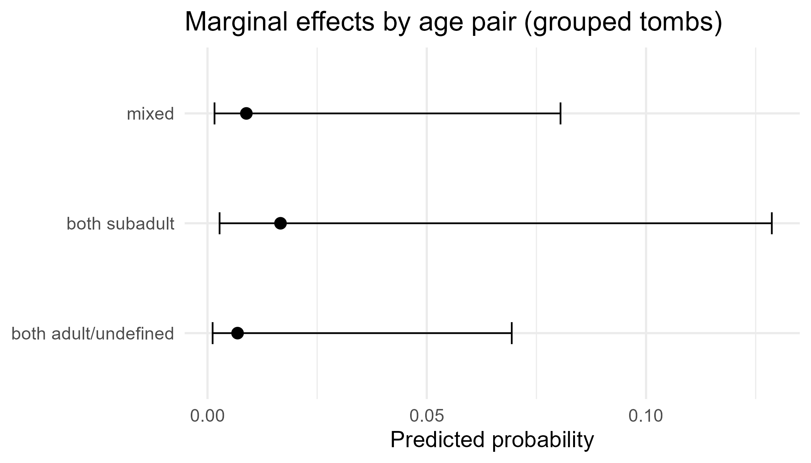
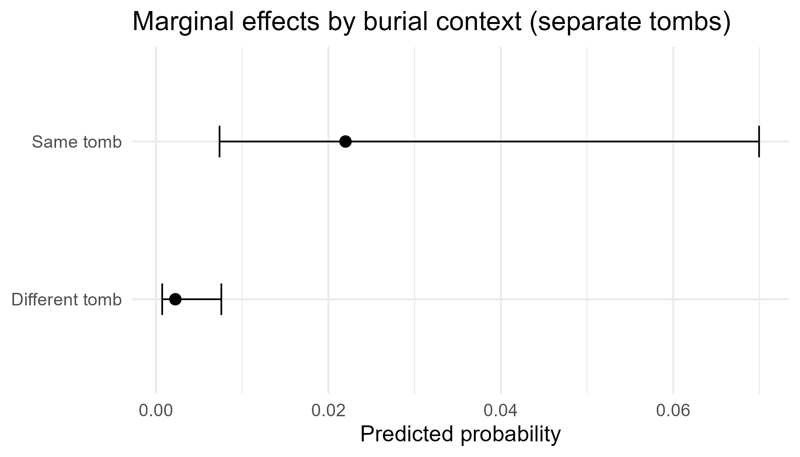
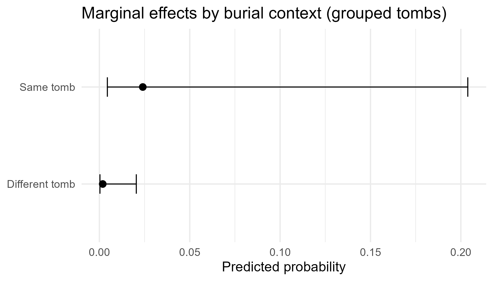
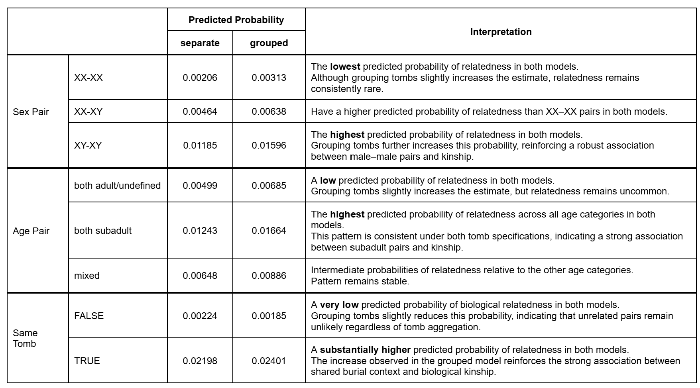

## Model Fitting

### Marginal Effect (Predicted Probabilities)

-   Logistic regression coefficients are on the **log-odds** scale (hard to interpret)
-   **Marginal predicted probabilities** convert model results into **probabilities** of the outcome (*being related*)
-   *“The average probability that a pair is related is obtained by averaging population-level predictions across all observations, holding other variables at their observed values.”*

## Model Fitting (do not put this)

### Model Interpretation

#### Sex Pair

::: {style="display:flex; gap:20px;"}
 
:::

## Model Fitting (do not put this)

### Model Interpretation

#### Age Pair

::: {style="display:flex; gap:20px;"}
 
:::

## Model Fitting (do not put this)

### Model Interpretation

#### Tomb

::: {style="display:flex; gap:20px;"}
 
:::

## Model Fitting

### Model Interpretation

{fig-align="center" width="90%"}
